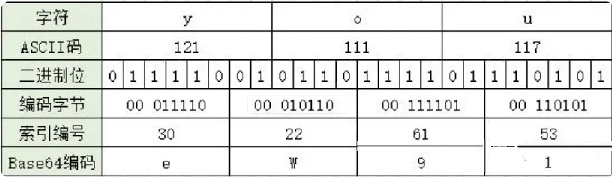

# JavaScript高级逆向V5

# 一、JavaScript基础与进阶

## 1.1、JavaScript基础语法

### 【1】JavaScript初识

 JavaScript 是一种用于在客户端（即用户的浏览器）上运行的编程语言。它是一种脚本语言，可以直接嵌入到 HTML 页面中，并由浏览器解释和执行。

在客户端环境中，JavaScript 可以与用户交互，操作和修改网页的内容、结构和样式。它可以用于处理用户输入、响应事件、进行表单验证、创建动态效果等。JavaScript 还可以通过浏览器提供的 API 访问浏览器功能，例如操作 DOM（文档对象模型）、发送网络请求、处理本地存储等。

需要注意的是，JavaScript 也可以在服务器端运行，例如使用 Node.js 环境。在服务器端，JavaScript 可以用于构建网络应用、处理后端逻辑等。但在这种情况下，它并不是典型的“客户端语言”，而是作为一种通用的脚本语言使用。

**demo服务端：**

```python
from flask import Flask, render_template, jsonify
import datetime

app = Flask(__name__, template_folder="templates", static_folder='static')


@app.get("/index")
def index():
    timer = datetime.datetime.now().strftime("%Y-%m-%d:%X")
    return render_template("index.html", **{"timer": timer})

@app.get("/books")
def get_books():
    # 数据库获取书籍
    books = ["聊斋志异", "金瓶梅", "国色天香", "剪灯新话"]
    return jsonify(books)

app.run()

```

**demo客户端：**

```html
<!DOCTYPE html>
<html lang="en">
<head>
    <meta charset="UTF-8">
    <title>Title</title>
    <style>
        p {
            color: rebeccapurple;
        }
    </style>
</head>
<body>

<h3>Hello Alex!</h3>
<p>当前时间：{{timer}}</p>
<p class="books">四大名著</p>
<p class="books_box"></p>

<script>
    var dom = document.getElementsByTagName("h3")[0]
    dom.onclick = function () {
        this.style.color = "green"
    }
</script>
<script src="https://cdn.bootcdn.net/ajax/libs/jquery/3.7.1/jquery.js"></script>
<script>
    $(".books").click(function () {
        $.ajax({
            url: "http://127.0.0.1:5000/books",
            success: function (res) {
                console.log("响应数据:", res);
                $(".books_box").append(res.join("，"))
            }
        })
    })
</script>

</body>
</html>
```

### 【2】基本语法

```js
// JS代码导入方式：
// 1 直接编写
   /*
    <script>
        console.log('hello yuan')
    </script>
    */
// 2 导入文件

// <script src="hello.js"></script>


// 单行注释
/*
    这是
    多行
    注释
        */
     
// 语句分隔符 ; 表示一行代码的结束
```

### 【3】变量与数据类型

```js
// (1) 声明变量
var x;  // 声明一个变量叫x, x没有值. 此时打印x的内容是undefined(没有被定义)

// 对x进行打印看看效果.
// 在控制台记录xxxx => python中的print()
// 查看打印的内容在F12 -> Console -> 可以看到打印的内容

console.log(x);

// (2) 基本数据类型：number string  bool

var x = 3.1415; // 声明变量x, 并且给x一个初始值. 123
console.log(typeof x); // 可以查看数据类型. 但是只能看基础数据类型.

var x = "hello yuan";
console.log(typeof x); // string 字符串

var x1 = true;
var x2 = false; // 布尔值. python里面是大写的. js里面是小写.

console.log(typeof x1); // boolean 布尔. python简化成bool

// (3) 高级数据类型：  数组[]    对象{}    

var x = [1,2,3]; // 数组. => python的列表.
console.log(typeof x);  // 类型叫object

var x = {name:"yuan",age:22}; // 对象 => python的字典.
console.log(typeof x); // 也是object

// (4) 两个特殊值:   undefined null

var x; // undefined
console.log(typeof x);  // undefined类型... 不占用内存空间的

var x = null; // 空.... 是python的None, 要使用堆内存的....
console.log(typeof x); // object类型

// 一次性可以声明多个变量
var name="yuan", age=20, job="lecturer";
var a, b, c=3, d, e = 5; // 从左到右,声明5个变量, 其中, c=3, e=5

```

类型转换：
```js
// 在js中. 所有的数据和字符串相加. 结果都是字符串拼接.(重点)
var a = 123;
var b = "我爱你";
console.log(a + b);
console.log(1+1); // 2

var a = "123"; // 字符串
// 字符串转化成整数
// parse 转换
// Int 整数
a = parseInt(a);
console.log(a + 3); // 126 数学上的加法. 证明转化成功了.

var a = 123; // 转化成字符串
var b = a.toString(); // 把数字, 转化成字符串
console.log(b + 3); //"1233"

// 一般的程序员不用toString()的.
var a = 123;
var b = a + ""; // 在逆向的过程中. 这种写法是最多的.
console.log(b+333); // "123333" 字符串


var a = 123;
// 数字的toString()可以指定进制
var b = a.toString(16);
console.log(b);

var m = '7b'; // 眼睛看着是字符串. 但是我们知道它应该是一个十六进制的字符串.
// 字符串, 转化成 整数   parseInt
var n = parseInt(m, 16);
console.log(n)
```

### 【4】运算符

```js
// （1） 科学运算符
 + - * / %

// （2）比较运算符
> <   <=  >= === !==

// （3） 赋值运算符 
+= -= *= /=  ++

// 在单独使用a++和++a是没有区别的. 都是让a自增1
var b = a ++;  // 先赋值, 后运算...

console.log(a); // 11
console.log(b); // 10

var b = ++ a; // 先计算, 后赋值
console.log(a);
console.log(b);

// （4）逻辑运算符： Python中的and, or, not
// &&, 并且, 左右两端必须同时为真, 结果才能是真..
// ||, 或者, 左右两端, 有一个是真, 结果就是真
// !, 非/不, 非真即假, 非假既真.

console.log(1 > 2 || 3 < 5);
console.log(1 > 2 && 3 < 5);

console.log(!true);
console.log(!false);

// x() && y()
// 该逻辑叫短路...如果前面的表达式已经得到结果了. 后面就不运行了. 相同的逻辑还有||
// 如果x()返回真. 则运行y()
// 如果x()返回假, 则不运行y(). 直接结束判断了.


// （5）逗号运算符
a = 1,2,3,4
b = (1,"yuan",true)
// （6）三目运算：条件? 成立: 不成立
// 案例1
var a = 100;
var b = 20;
var c = a > b ? a: b;
console.log(c);
// 案例2:终极一练

let a = 10;
let b = 20;
let c = 5;
let d = 17;

let e;
let m;
e = (e = a > 3 ? b : c, m = e < b++ ? c-- : a = 3 > b % d ? 27: 37, m++);
// e = a > 3 ? b : c; // e = 20
// b = 21 , m 和 a都是37
// m = e < b++ ? c-- : a = 3 > b % d ? 27: 37;
// e = m++; // e 37  m 38  a 37
```

### 【5】流程控制语句

分支语句

```js
// 分支语句
if(条件){
     // 条件为true时,执行的代码
   }else{
     // 条件为false时,执行的代码
 }  

switch(条件){
    case 结果1:
         // 满足条件执行的结果是结果1时,执行这里的代码..
         break;
    case 结果2:
         // 满足条件执行的结果是结果2时,执行这里的代码..
         break;
    ...
    default:
         // 条件和上述所有结果都不相等时,则执行这里的代码
   }


// （1）双分支
var age = 23
if (age > 18) {
    console.log("播放成人电影！")
} else {
    console.log("播放未成年电影")
}

// （2）多分支
var score = 45;
if (score >= 90) {
    console.log("A");
} else if (score >= 80) {
    console.log("B");
} else if (score >= 70) {
    console.log("C");
} else if (score >= 60) {
    console.log("D");
} else {
    console.log("E");
}

// （3）switch多分支
var week = 3;
switch(week){
    case 1:
        console.log("星期一");
        break;
    case 2:
        console.log("星期二");
        break;
    case 3: // 某一个case匹配成功. 那么后面的case就不判断了, 直接被执行.
        console.log("星期三");
        break;
    case 4:
        console.log("星期四");
        break;
    case 5:
        console.log("星期五");
        break;
    case 6:
        console.log("星期六");
        break;
    case 7:
        console.log("星期天");
        break;
    default:
        console.log("啥也不是!");
        break;
}
```

循环语句

```js
/*

// 循环语句
while(循环的条件){
      // 循环条件为true的时候,会执行这里的代码
   }
   
// 循环三要素
for(1.声明循环的开始; 2.条件; 4.循环的计数){
   // 3. 循环条件为true的时候,会执行这里的代码
} 
 
 * 1. 首先, 会执行语句1, 通常会在语句1里完成对循环变量的初始化
 * 2. 然后, 判断表达式2计算的结果是否是真, 如果是真, 则执行循环体, 如果是假, 结束循环
 * 3. 执行完循环体后. 执行表达式3，然后回到第二步...
 
 */

// while 循环
var a = 0; // 1. 初始变量
while (a < 100) {  // 2. 条件判断
    console.log("我爱你");  // 业务需求...循环内容...
    a++;  // 3. 步进语句
}


for(var i = 0; i < 10; i++){
    console.log(i);
}

```

### 【6】字符串对象

```js
// js的字符串对象
var s = "Hello Yuan      "
console.log(s.toUpperCase())
console.log(s.toLowerCase())
console.log(s.slice(0, 5))
console.log(s.split(" ")) // ["Hello","Yuan"]
console.log(s.length)
console.log(s.trim(" ").length)
console.log(s.trimEnd(" ").length)
console.log(s.indexOf("Yuan"))
console.log(s.replace("Yuan","Rain"))
console.log(s.startsWith("Hel"))
```

### 【7】数组

```js
// 注意, 前端js里面的数组. 相当于python的列表, java的List

// 创建数组的方法;
// 1. 直接赋值一个数组
var arr1 = [11,22,33];
console.log(arr1);

// new表示创建对象.  理解成分配内存.
var arr2 = new Array();  // var arr2 = []

// 1. push 在数组的末尾添加数据...
// 2. pop 在数组的末尾删除数据
var arr = [11,22,33,44];
arr.push(55);
var item = arr.pop();
console.log(item);


// 1 unshift 在数组的首位添加数据...  2 shift 删除数组的首位数据

var arr = [11,22,33];
arr.unshift(0); // 在数组的前面插入数据
// console.log(arr);
var item = arr.shift();
console.log(item);
console.log(arr);

var arr = ["a","b","c"];
arr.splice(1,1);
arr.splice(1,0,"b")
arr.splice(1,1,"B")

arr.reverse();

// slice(开始下标,结束下标)  切片,开区间
arr.slice(1,3)

var arr = ["北京","深圳","广州"];
console.log(arr.join(",")); // 把数组转化成字符串

// 循环和遍历
//  key       0         1       2       3       4         5
var arr = ["朱元璋", "朱允炆", "朱棣", "朱高炽", "朱高煦", "朱瞻基"];

// 三要素for循环
for(var i = 0; i < arr.length; i++){
    console.log(arr[i]);
}

// for-in
for(var x in arr){ // 此时拿到的是数组的索引(key)
    console.log(x);
}

// for-of
for (var x of arr){ // 此时拿到的是数组的元素(value)
    console.log(x);
}

// arr中的每一个元素执行里面传递进去的函数
// 回调函数的参数是 元素和索引

console.log(ret);

// 高阶函数 map filter
```

### 【8】对象

```js
var obj = {
          "name": "yuan",
          age: 18,
          girl_friend: {
              name: "高圆圆",
              age: 28
          }
      }

// 当他是python的字典, 无缝衔接的. `[]` 也可以翻译成`的`
console.log(obj['girl_friend']['name']);
// 当他是对象... 对象.属性  `.`可以翻译成`的`
console.log(obj.name)
console.log(obj.girl_friend.name)

// 它俩可以混着来.
var w = "girl_friend"
console.log(obj[w].name);
console.log(obj.girl_friend['name']);
// js的对象在使用的时候. 既可以通过`[]`来获取属性的值. 也可以通过`.`来获取属性的值
// 区别: []里面必须放字符串.
//       .后面放的必须是属性名(不可以是字符串)
console.log(obj.girl_friend.name); // 68

// 如果想要对代码进行伪装,混淆. 就不能用`.`

console.log(obj['girl_friend']['name']); // 高圆圆
console.log(obj.girl_friend.name); // 高圆圆


var obj = {};
obj.name = "alvin";  // 对象.属性 = 值. 可以给对象增加新的属性(设置一个新的属性)
obj['age'] = 28;

console.log(obj);
```

序列化和反序列化：

| 方法                      | 描述                                          |
| ------------------------- | --------------------------------------------- |
| **`JSON.stringify(obj)`** | 把obj对象转换成json格式字符串，会移除对象方法 |
| **`JSON.parse(str)`**     | 把符合json语法的字符串转换成js对象            |

### 【9】其它常用对象

```js
// Math对象 Date类
var now=new Date();
console.log(now.toLocaleString( ));

// console.log(Math.random());
console.log( Math.round(Math.random() * 10 ));
```

## 1.2、函数

### 【1】函数初识

```js
// 函数声明
function 函数名(形参){
   return // 返回值
}

// 函数调用
函数名(实参)

// 编译运行
// 默认返回undefined
// arguments参数

```

### 【2】作用域

作用域（Scope）是指在程序中定义变量的可访问性和可见性的范围。它决定了在代码中的哪些位置可以访问或引用特定变量、函数或对象。

在大多数编程语言中，包括 JavaScript，在不同的作用域中定义的变量具有不同的可见性和生命周期。常见的作用域类型有以下几种：

1. 全局作用域（Global Scope）：全局作用域是在整个程序中都可访问的作用域。在全局作用域中声明的变量可以在程序的任何位置被访问。
2. 函数作用域（Function Scope）：函数作用域是在函数内部定义的作用域。在函数作用域中声明的变量只能在函数内部被访问，它们对于函数外部是不可见的。每当函数被调用时，都会创建一个新的函数作用域。
3. 块级作用域（Block Scope）：块级作用域是在代码块（通常由花括号 `{}` 包围）内定义的作用域。在块级作用域中声明的变量只能在该块内部被访问，而在块外部是不可见的。在 ES6 中引入的 `let` 和 `const` 关键字可以用来创建块级作用域。

```js
//  首先熟悉下var

var name = "yuan"; // 声明一个全局变量 name并赋值”yuan“
name = "张三";  // 对已经存在的变量name重新赋值 ”张三“
console.log(name);

age = 18   // 之前不存在age变量，这里等同于var age = 19 即声明全局变量age并赋值为18

var  gender = "male"
var  gender = "female" // 原内存释放与新内存开辟，指针指向新开辟的内存
console.log(gender)
```

作用域案例：

```js
var num = 10; // 在函数外部声明的变量, 全局变量
function func(){
    // num = 20; // 函数内部直接使用变量,则默认调用了全局的变量,
    //var num = 20;                  
    console.log("函数内部num：",num)
}
func();
console.log("全局num：",num);
```

作用域的正确使用可以避免变量名冲突和数据泄漏，并提供更好的代码封装和隔离性。理解作用域的概念对于编写可维护和可扩展的代码非常重要。

### 【3】匿名函数

在 JavaScript 中，匿名函数是一种没有名称的函数定义。匿名函数可以被直接传递给其他函数作为参数，也可以被赋值给变量或对象的属性，以便稍后调用。

```js
// 匿名函数赋值变量
 var foo = function () {
     console.log("这是一个匿名函数！")
 };

// 匿名函数的自执行
(function (x,y) {
     console.log(x+y);
 })(2,3)

// 匿名函数作为一个高阶函数使用
function bar() {

  return function () {
      console.log("inner函数！")
  }
}

bar()()
```

匿名函数常用于回调函数、事件处理程序、异步操作等场景，它们允许我们在需要时动态定义函数逻辑，并将其作为值传递或存储，而不需要为函数命名。这提供了更灵活和简洁的编程方式。

### 【4】闭包函数

闭包（closures）是 Javascript 语言的一个难点，也是它的特色，很多高级应用都是依靠闭包实现的。闭包与变量的作用域以及变量的生命周期密切相关，本节我们就来简单介绍一下。

> 在计算机科学中，闭包（英语：Closure），又称词法闭包（Lexical Closure）或函数闭包（function closures），是引用了自由变量（外部非全局）的函数。

简单来说就是一个函数定义中引用了函数外定义的变量，并且该函数可以在其定义环境外被执行。这样的一个函数我们称之为闭包函数。

```html
<!DOCTYPE html>
<html lang="en">
<head>
    <meta charset="UTF-8">
    <title>Title</title>
    <script>

        function getCounter() {

            let count = 0

            function counter() {
                let name = "yuan"
                count++  // count = count+1
                return count
            }

            window.yuan = counter

            // counter()
            // counter()
            // counter()
            return counter
        }

        // c1 = getCounter()
        // c1()
        // c1()
        // c2 = getCounter()
        // c2()
        // c2();

        getCounter()

        let c3 = window.yuan
        console.log(c3())
        console.log(c3())
        console.log(c3())
    </script>
    <script>
        var count = 100
    </script>
</head>
<body>

<button onclick="c1()">add1</button>
<button onclick="c2()">add2</button>
</body>
</html>
```

### 【5】原型对象（prototype）

在JavaScript中，每个对象都有一个特殊的属性叫做"prototype"（原型）。它是一个指向另一个对象的引用，在对象之间实现继承关系。

当你访问一个对象的属性或方法时，如果该对象自身没有这个属性或方法，JavaScript引擎会自动去该对象的原型中查找。如果原型中也没有找到，那么会继续在原型的原型中查找，直到找到该属性或方法或者到达原型链的末尾。

在JavaScript中，原型的概念与面向对象编程的继承紧密相关。你可以通过原型来共享属性和方法，从而实现对象之间的继承关系。

案例1:

```js
function Person(name) {
  this.name = name;
}

Person.prototype.greet = function() {
  console.log("Hello, my name is " + this.name);
};

var person = new Person("John");
person.greet(); // 输出：Hello, my name is John
```

> 1. prototype(原型对象)就是一个容器.   {}，存放公共的方法给对象使用.
> 3. 对象可以直接访问原型对象中的方法和属性.
> 4. 原型对象类似Python的类对象（fn.prototype）

原型对象和函数之间的关系.

> - 每个函数都会有一个`prototype`属性,指向原型对象.
> - 每个原型对象都会有一个`constructor`属性,指向函数.
> - 总结:每个函数与原型对象之间的关系是`互相引用`.


对象和原型对象和函数之间的关系

> - 函数创建对象`var o = new Fn();`
> - 对象通过`__proto__`属性,指向原型对象.
> - 对象可以直接调用原型对象中所有的属性和方法.
> - 对象可以通过原型对象中的constructor属性知道构造函数
> - 总结: 原型对象就是一个容器,帮助函数存放公共方法,以及给函数new出来的对象提供公共方法使用.


```js
function Dog(name, age) {
    this.name = name;//面试题：构造函数中的this指向谁？ 答：指向new创建的对象
    this.age = age;
    this.sleep = function () {
        console.log("sleeping")
    }

}

// Dog("rain",12) // 普通函数
//构造函数
let alex = new Dog("alex", 36);   // 使用new来创建对象
let eric = new Dog("eric", 35);   // 使用new来创建对象

// (1) 函数对象通过prototype容器设置公共属性和方法
Dog.prototype.eat = function (food) {
    console.log(this.name +"吃"+ food);
}

alex.eat("吃骨头")
eric.eat("吃肉")

// (2) 对象通过`__proto__`属性,指向原型对象
console.log(alex.__proto__)
console.log(alex.__proto__.constructor.name)
console.log(alex.__proto__.constructor)

// 看看能不能理解
console.log(alex.__proto__ === Dog.prototype)
console.log(Dog.prototype)

alex.age = 100
console.log(alex.age) // 先查找自己的空间，找不到，去原型中找
console.log(eric.age)

// 猜一猜1
Dog.prototype.sleep =function (){
    console.log("prototype sleeping")
}

alex.sleep()

// 猜一猜2
let zhangSan = new Dog("张三", 35);
Dog.prototype = {
    fly:function (){
        console.log("flying...")
    }
}
// let zhangSan = new Dog("张三", 35);
// zhangSan.fly()
zhangSan.eat("辣条")

```

### 【6】call和apply方法

call，apply都属于Function.prototype的一个方法，它是JavaScript引擎内在实现的，因为属于Function.prototype，所以每个Function对象实例(就是每个方法)都有call，apply属性。既然作为方法的属性，那它们的使用就当然是针对方法的了，这两个方法是容易混淆的，因为它们的作用一样，只是使用方式不同。

```js
foo.call(this, arg1,arg2,arg3) == foo.apply(this, arguments) == this.foo(arg1, arg2, arg3);
```

案例1:

```js
function Person(name, age) {
    this.name = name
    this.age = age
}

Person.prototype.eat = function () {
    console.log(this.name + "正在吃东西")
}

p = new Person("yuan", 22)

p.eat()
```

案例2:

```js
function Person(name, age) {
    this.name = name
    this.age = age
}
p = new Person("yuan", 22)

function eat () {
    console.log(this.name + "正在吃东西")
}
eat.call(p)
```

案例3:

```js
function Person(name, age) {
    this.name = name
    this.age = age
}
p = new Person("yuan", 22)

function eat () {
    console.log(this.name + "正在吃东西")
}
eat.call(p)
eat.apply(p)
```

> 如果call和apply的第一个参数写的是null，那么this指向的是window对象

案例4:

```js
function Person(name, age) {
    this.name = name
    this.age = age
}

p = new Person("yuan", 22)

function eat(a, b, c) {
    console.log(this.name + "正在吃东西")
    console.log(a, b, c)
}

eat.call(p, "1", "2", "3")
eat.apply(p, ["1", "2", "3"])
// apply传递多个参数的时候第二个参数需要传递一个数组
```

### 【7】ES6中的箭头函数

在ES6中简化了函数的声明语法. 

```js
// es6允许使用“箭头”(=>)定义函数。
var f = v => v*v
// 等同于
var f = function(v) {
 return v
}

// 如果箭头函数不需要参数或需要多个参数，就使用一个圆括号代表参数部分。
var f = () => 5
// 等同于
var f = function() {
   return 5
}
 
var sum = (num1, num2) => num1 + num2
// 等同于
var sum = function(num1, num2) {
   return num1 + num2
}

// 如果箭头函数的代码块部分多于一条语句，就要使用大括号将它们括起来，并且使用return语句返回。
var sum = (num1, num2) => {return num1 + num2}

//由于大括号被解释为代码块，所以如果箭头函数直接返回一个对象，必须在对象外面加上括号，否则会报错。

// 报错
let getUser = id => {id: id, name: "yuan"}
// 不报错
let getUser = id => ({id: id, name: "yuan"})


// 箭头函数的一个用处是简化回调函数。
// 正常函数写法
[1, 2, 3].map(function(x) {
 return x * x
})
// 箭头函数写法
[1, 2, 3].map(x => x * x)
```

### 【8】exports

```js
// functions.js

// 加法函数
function add(a, b) {
  return a + b;
}

// 乘法函数
function multiply(a, b) {
  return a * b;
}

// 导出函数
exports.add = add;
exports.multiply = multiply;
// exports :func
```

```js
// main.js

// 导入 functions 模块
const functions = require('./functions');

// 使用导入的函数
console.log(functions.add(2, 3));  // 输出: 5
console.log(functions.multiply(4, 5));  // 输出: 20
```

## 1.3、Window对象

window 是客户端浏览器对象模型的基类，window 对象是客户端 JavaScript 的全局对象。一个 window 对象实际上就是一个独立的窗口，对于框架页面来说，浏览器窗口每个框架都包含一个 window 对象。

### 【1】全局作用域

在客户端浏览器中，window 对象是访问 BOM 的接口，如引用 document 对象的 document 属性，引用自身的 window 和 self 属性等。同时 window 也为客户端 JavaScript 提供全局作用域。

由于 window 是全局对象，因此所有的全局变量都被解析为该对象的属性。

```html
<script>

    var username = "yuanhao";  //全局变量
    function f() {  //全局函数
        console.log(username);
    }
  
    console.log(window.username);  //返回字符串“yuanhao”
    window.f();  //返回字符串“yuanhao”

</script>


```

### 【2】使用系统对话框

window 对象定义了 3 个人机交互的方法，主要方便对 JavaScript 代码进行调试。

- alert()：确定提示框。由浏览器向用户弹出提示性信息。该方法包含一个可选的提示信息参数。如果没有指定参数，则弹出一个空的对话框。
- confirm()：选择提示框。。由浏览器向用户弹出提示性信息，弹出的对话框中包含两个按钮，分别表示“确定”和“取消”按钮。如果点击“确定”按钮，则该方法将返回 true；单击“取消”按钮，则返回 false。confirm() 方法也包含一个可选的提示信息参数，如果没有指定参数，则弹出一个空的对话框。
- prompt()：输入提示框。可以接收用户输入的信息，并返回输入的信息。prompt() 方法也包含一个可选的提示信息参数，如果没有指定参数，则弹出一个没有提示信息的输入文本对话框。

### 【3】访问客户端对象

使用 window 对象可以访问客户端其他对象，这种关系构成浏览器对象模型，window 对象代表根节点，浏览器对象关系的关系如图所示，每个对象说明如下。

- window：客户端 JavaScript 顶层对象。每当 <body> 或 <frameset> 标签出现时，window 对象就会被自动创建。
- navigator：包含客户端有关浏览器信息。
- screen：包含客户端屏幕的信息。
- history：包含浏览器窗口访问过的 URL 信息。
- location：包含当前网页文档的 URL 信息。
- document：包含整个 HTML 文档，可被用来访问文档内容及其所有页面元素。

### 【4】使用定时器

window 对象包含 4 个定时器专用方法，说明如下表所示，使用它们可以实现代码定时执行，或者延迟执行，使用定时器可以设计演示动画。

| 方法            | 说明                                             |
| --------------- | ------------------------------------------------ |
| setInterval()   | 按照执行的周期（单位为毫秒）调用函数或计算表达式 |
| setTimeout()    | 在指定的毫秒数后调用函数或计算表达式             |
| clearInterval() | 取消由 setInterval() 方法生成的定时器            |
| clearTimeout()  | 取消由 setTimeout() 方法生成的定时器             |

setTimeout() 方法能够在指定的时间段后执行特定代码。用法如下：

`var o = setTimeout(code, delay)`

参数 code 表示要延迟执行的字符串型代码，将在 Windows 环境中执行，如果包含多个语句，应该使用分号进行分隔。delay 表示延迟时间，以毫秒为单位。

该方法返回值是一个 Timer ID，这个 ID 编号指向延迟执行的代码控制句柄。如果把这个句柄传递给 clearTimeout() 方法，则会取消代码的延迟执行。

```html
<!DOCTYPE html>
<html lang="en">
<head>
    <meta charset="UTF-8">
    <title>Title</title>
</head>
<body>

<input id="ID1" type="text" >
<button onclick="begin()">开始</button>
<button onclick="end()">停止</button>

<script>
    function showTime(){
           var nowd2=new Date().toLocaleString();
           var temp=document.getElementById("ID1");
           temp.value=nowd2;

    }
    var ID;
    function begin(){
        if (ID==undefined){
             showTime();
             ID=setInterval(showTime,1000);
        }
    }
    function end(){
        clearInterval(ID);
        ID=undefined;
    }

</script>

</body>
</html>
```

# 二、JS逆向爬虫专项

## 2.1、编码

### 【1】url编码

```python
import urllib.parse 

# s = 'a'
s = ' 123'
ret = urllib.parse.quote(s)
print(ret)
s = urllib.parse.unquote(ret)
print(s)

params = {'name': '张三', 'age': 20, 'address': '北京市海淀区'}
query_string = urllib.parse.urlencode(params)
print(query_string)

query_string = 'name=%E5%BC%A0%E4%B8%89&age=20&address=%E5%8C%97%E4%BA%AC%E5%B8%82%E6%B5%B7%E6%B7%80%E5%8C%BA'
params = urllib.parse.parse_qs(query_string)
print(params, type(params))
```

### 【2】 base64编码

#### （1）base64是什么

Base64编码，是由64个字符组成编码集：**26个大写字母A~Z，26个小写字母a~z，10个数字0~9，符号“+”与符号“/”**。Base64编码的基本思路是**将原始数据的三个字节拆分转化为四个字节**，然后根据Base64的对应表，得到对应的编码数据。

当原始数据凑不够三个字节时，编码结果中会使用额外的**符号“=”**来表示这种情况。

#### （2）base64原理


一个Base64字符实际上代表着6个二进制位(bit)，4个Base64字符对应3字节字符串/二进制数据。

3个字符为一组的的base64编码方式如：



小于3个字符为一组的编码方式如：


总结：base64过程


最后处理完的编码字符再转字节中不再有base64以外的任何字符。

#### （3）base64测试

```python
import base64

bs = "you".encode("utf-8")
# 把字节转化成b64
print(base64.b64encode(bs).decode())

bs = "yo".encode("utf-8")
# 把字节转化成b64
print(base64.b64encode(bs).decode())

# 猜测结果
bs = "y".encode("utf-8")
# 把字节转化成b64
print(base64.b64encode(bs).decode())


```

注意, b64处理后的字符串长度. 一定是4的倍数. 如果在网页上看到有些密文的b64长度不是4的倍数. 会报错

例如, 

```python
import base64

s = "eW91"
ret = base64.b64decode(s)
print(ret)

s = "eW91eQ=="
ret = base64.b64decode(s)
print(ret)

s = "eW91eQ"
ret = base64.b64decode(s)
print(ret)
```

解决思路. base64长度要求. 字符串长度必须是4的倍数. 填充一下即可

```python
s = "eW91eQ"
# ret = base64.b64decode(s)
# print(ret)

s += ("=" * (4 - len(s) % 4))
print("填充后", s)
ret = base64.b64decode(s).decode()
print(ret)
```

#### （4）base64变种

```python
# 方式1
data = res.text.replace("-", "+").replace("_", "/")
base64.b64decode(data)
# 方式2
data = base64.b64decode(res.text, altchars=b"-_")  # base64解码成字节流
```

#### （5）为什么要base64编码

base64 编码的优点：

- 算法是编码，不是压缩，编码后只会增加字节数（一般是比之前的多1/3，比如之前是3， 编码后是4）
- 算法简单，基本不影响效率
- 算法可逆，解码很方便，不用于私密传输。
- 加密后的字符串只有【0-9a-zA-Z+/=】 ，不可打印字符（转译字符）也可以传输（关键！！！）

有些网络传输协议是为了传输`ASCII文本`设计的，当你使用其传输二进制流时（比如视频/图片），二进制流中的数据可能会被协议错误的识别为控制字符等等，因而出现错误。那这时就要将二进制流传输编码，因为有些8Bit字节码并没有对应的ASCII字符。

比如十进制ASCII码8对应的是后退符号(backspace), 如果被编码的数据中包含这个数值，那么编码出来的结果在很多编程语言里会导致前一个字符被删掉。又比如ASCII码0对应的是空字符，在一些编程语言里代表字符串结束，后续的数据就不会被处理了。

用Base64编码因为限定了用于编码的字符集，确保编码的结果可打印且无歧义。

不同的网络节点设备交互数据需要：设备A把base64编码后的数据封装在`json字符串`里，设备B先解析json拿到value，再进行base64解码拿到想要的数据。

> 1. 早年制定的一些协议都是只支持文本设定的。随着不断发展需要支持非文本了，才搞了一个base64做兼容
>
> 2. 虽然编码之后的数据与加密一样都具有不可见性，但编码与加密的概念并不一样。编码是公开的，任何人都可以解码；而加密则相反，你只希望自己或者特定的人才可以对内容进行解密。

base64处理图片数据：

```python
import base64
source = "data:image/png;base64,iVBORw0KGgoAAAANSUhEUgAAACAAAAAgCAMAAABEpIrGAAAA7VBMVEUAAAD////////s8v////+txP+qwv+4zf/w9f/2+P+hu//Q3f+yyP+4zf/Q3f////+kvv+90P+80f+2yv/S4P/T4P/M2//z9/+cuP/V4P9Whv////9Uhf9Sg/9Pgf9NgP/8/f9di/9Xh/9lkf5aif9qlP7z9//k7P/c5v+2y/94nv51nP6lv/+LrP6Ep/6BpP5gjf7v9P+wxv/U4f/M2/+sxP+vxv73+f/P3v/J2v+5zf+ivP+fuv9xmf+Ytv6Usv6Hqf58of5vl/7m7v/g6f+zyf6QsP75+//q8P/B0v/W4//C1P6+0P6qwv6ct/76fHZiAAAAGnRSTlMAGAaVR/Py45aC9Mfy2b8t9OPZ2ce/v4L0x/e74/EAAAIZSURBVDjLZVPXYuIwEDSmQ4BLv5O0ku3Yhwu2IZTQe0hy7f8/57QSoYR5sVea1c424wgzl324LRRuH7I507hEJluYucCFEOBGhWzmy7X5+N0WwIjTbrcdBsKulM0z96onGCGE2X6n+cTkj/CqJ480igzkNXp26E9JkABSbBz8i4Bn3EkH840mKHoxs49fZQzt2Kd03FQEzSB3WsejB9Jqf1CJQBM0wCurABWBoub0gkDENwyStTHA62pwSWDtklRQ4FLfjnaiPqVW60hAYeLKNHIREOZuKTL80H6XBFCwn4BAmDOyLiOQUIlOSEjaoS+Ju57NZuul73Fml4w6yAivSLBW3MGfcfBmIegmArg3alICdJHgy1jQt8Z/6CcC4DdGXhLIoiWRACpbLYbDYW80GnXp2GH8ShP+PUvEoHsAIFq9Xm8+kXlIwkkI9pm+05Tm3yWqu9EiB0pkwjWBx2i+tND1XqeZqpPU4VhUbq/ekR8CwTRVoRxf3ifTbeIwcONNsJZ2lxFVKDMv1KNvS2zXdrnD+COvR1PQpTZKNlKD3cLCOJNnivgVxkw169BunlKFaV9/B+LQbqOsByY4IVgDB59dl/cjR9TIJV1Lh7CGqUqH/DDPhhZYOPkdLz6m0X7GrzPHsSe6zJwzxvm+5NeNi8U5ABfn7mz7zHJFrZ6+BY6rd7m8kQtcAtwwXzq4n69/vZbP1+pn6/8fsrRmHUhmpYYAAAAASUVORK5CYII="
s = source.split(",")[1]
with open("a.png", "wb") as f:
    f.write(base64.b64decode(s))
```

## 2.2、摘要&加密算法

###  【1】摘要算法：一切从MD5开始

MD5是一个非常常见的摘要(hash)逻辑.  其特点就是小巧. 速度快. 极难被破解. 所以, md5依然是国内非常多的互联网公司选择的密码摘要算法. 

> 1. 这玩意不可逆. 所以. 摘要算法就不是一个加密逻辑. 
>
> 2. 相同的内容计算出来的摘要是一样的
>
> 3. 不同的内容(哪怕是一丢丢丢丢丢不一样) 计算出来的结果差别非常大

在数学上. 摘要其实计算逻辑就是hash. 

hash(数据)  => 数字

 	1. 密码
 	2. 一致性检测  

md5的python实现:

```python
from hashlib import md5

obj = md5()
obj.update("yuan".encode("utf-8"))
# obj.update("alex".encode('utf-8'))  # 可以添加多个被加密的内容

bs = obj.hexdigest()
print(bs)
```


我们把密文丢到网页里. 发现有些网站可以直接解密. 但其实不然. 这里并不是直接解密MD5. 而是"撞库". 

就是它网站里存储了大量的MD5的值. 就像这样:


而需要进行查询的时候. 只需要一条select语句就可以查询到了. 这就是传说中的撞库. 

如何避免撞库: md5在进行计算的时候可以加盐. 加盐之后. 就很难撞库了. 

```python
from hashlib import md5


salt = "我是盐.把我加进去就没人能破解了"
obj = md5(salt.encode("utf-8"))  # 加盐
obj.update("alex".encode("utf-8"))

bs = obj.hexdigest()
print(bs)
```


扩展; sha256

```python
from hashlib import sha1, sha256
sha = sha256(b'salt')
sha.update(b'alex')
print(sha.hexdigest())
```

不论是sha1, sha256, md5都属于摘要算法. 都是在计算hash值. 只是散列的程度不同而已. 这种算法有一个特性. 他们是散列. 不是加密. 而且, 由于hash算法是不可逆的, 所以不存在解密的逻辑.

### 【2】对称加密（AES与DES）

AES是一种对称加密，所谓对称加密就是加密与解密使用的秘钥是一个。

常见的对称加密: AES, DES, 3DES. 我们这里讨论AES。

安装：

```python
pip install pycryptodome
```

AES 加密最常用的模式就是 CBC 模式和 ECB模式 ，当然还有很多其它模式，他们都属于AES加密。ECB模式和CBC 模式俩者区别就是 ECB 不需要 iv偏移量，而CBC需要。

```apl
"""
长度
    16: *AES-128*   
    24: *AES-192*
    32: *AES-256*
    
MODE 加密模式. 
    常见的ECB, CBC
    ECB：是一种基础的加密方式，密文被分割成分组长度相等的块（不足补齐），然后单独一个个加密，一个个输出组成密文。
    CBC：是一种循环模式，前一个分组的密文和当前分组的明文异或或操作后再加密，这样做的目的是增强破解难度。
"""
```

CBC加密案例（选择aes-128）：

```python
from Crypto.Cipher import AES
from Crypto.Util.Padding import pad
import base64

key = '0123456789abcdef'.encode()  # 秘钥: 因为aes-128模式，所以必须16字节
iv = b'abcdabcdabcdabcd'  # 偏移量：因为aes-128模式，所以必须16字节
text = 'alex is a monkey!'  # 加密内容，因为aes-128模式，所以字节长度必须是16的倍数
# while len(text.encode('utf-8')) % 16 != 0:  # 如果text不足16位的倍数就用空格补足为16位
#     text += '\0'
text = pad(text.encode(), 16)
print("完整text:", text)

aes = AES.new(key, AES.MODE_CBC, iv)  # 创建一个aes对象

en_text = aes.encrypt(text)  # 加密明文
print("aes加密数据:::", en_text)  # b"_\xf04\x7f/R\xef\xe9\x14#q\xd8A\x12\x8e\xe3\xa5\x93\x96'zOP\xc1\x85{\xad\xc2c\xddn\x86"

en_text = base64.b64encode(en_text).decode()  # 将返回的字节型数据转进行base64编码
print(en_text)  # X/A0fy9S7+kUI3HYQRKO46WTlid6T1DBhXutwmPdboY=
```

CBC解密案例：

````python
from Crypto.Cipher import AES
import base64
from Crypto.Util.Padding import unpad

key = '0123456789abcdef'.encode()
iv = b'abcdabcdabcdabcd'
aes = AES.new(key, AES.MODE_CBC, iv)

text = 'X/A0fy9S7+kUI3HYQRKO46WTlid6T1DBhXutwmPdboY='.encode()  # 需要解密的文本
ecrypted_base64 = base64.b64decode(text)  # base64解码成字节流
source = aes.decrypt(ecrypted_base64)  # 解密
print("aes解密数据:::", source.decode())
print("aes解密数据:::", unpad(source, 16).decode())
````

> 1. 在Python中进行AES加密解密时，所传入的密文、明文、秘钥、iv偏移量、都需要是bytes（字节型）数据。python 在构建aes对象时也只能接受bytes类型数据。
> 2. 当秘钥，iv偏移量，待加密的明文，字节长度不够16字节或者16字节倍数的时候需要进行补全。
>
> 3. CBC模式需要重新生成AES对象，为了防止这类错误，无论是什么模式都重新生成AES对象就可以了。

### 【3】非对称加密(RSA)

非对称加密. 加密和解密的秘钥不是同一个秘钥. 这里需要两把钥匙. 一个公钥, 一个私钥.  公钥发送给客户端. 发送端用公钥对数据进行加密. 再发送给接收端, 接收端使用私钥来对数据解密. 由于私钥只存放在接受端这边. 所以即使数据被截获了. 也是无法进行解密的. 

[公钥和私钥](https://blog.csdn.net/Ruishine/article/details/114705443)

常见的非对称加密算法: RSA, DSA等等, 我们就介绍一个. RSA加密, 也是最常见的一种加密方案

1. 创建公钥和私钥

```python
from Crypto.PublicKey import RSA

# 生成秘钥
rsakey = RSA.generate(1024)
with open("rsa.public.pem", mode="wb") as f:
    f.write(rsakey.publickey().exportKey())

with open("rsa.private.pem", mode="wb") as f:
    f.write(rsakey.exportKey())
```

2. 加密

```python
from Crypto.PublicKey import RSA
from Crypto.Cipher import PKCS1_v1_5
import base64


# 加密
data = "我喜欢你"
with open("rsa.public.pem", mode="r") as f:
    pk = f.read()
    rsa_pk = RSA.importKey(pk)
    rsa = PKCS1_v1_5.new(rsa_pk)

    result = rsa.encrypt(data.encode("utf-8"))
    # 处理成b64方便传输
    b64_result = base64.b64encode(result).decode("utf-8")
    print(b64_result)

```

3. 解密

```python
from Crypto.PublicKey import RSA
from Crypto.Cipher import PKCS1_v1_5
import base64

data = "BkiKG8jzVGzbWOl4m8NXJEYglgtxhOB05MGmap8JSP97GzoewPBmDTs7c5iACUof3k/uJf0H88GygajVgBvkcbckJp7oO+Qj6VSUQYTOHhKN/VG2a8v+WzL34EO/S7BYoj2oOxIDAr8wDLxYxjBeXq/Be6Q1yBbnZcKaMkifhP8="
# 解密
with open("rsa.private.pem", mode="r") as f:
    prikey = f.read()
    rsa_pk = RSA.importKey(prikey)
    rsa = PKCS1_v1_5.new(rsa_pk)
    result = rsa.decrypt(base64.b64decode(data), None)
    print("rsa解密数据:::", result.decode("utf-8")
```

## 2.3、JS版本的加密算法

### 【1】md5摘要算法

```js
const CryptoJS = require('crypto-js');
// 原始数据
const data = '123456';
// 生成MD5摘要
const md5Digest = CryptoJS.MD5(data).toString();

console.log(md5Digest);
```

### 【2】AES加密

```js
const CryptoJS = require("crypto-js")

// 密钥（128位，16字节）
var key = CryptoJS.enc.Utf8.parse('0123456789abcdef');

// 初始化向量（IV）（128位，16字节）
var iv = CryptoJS.enc.Utf8.parse('1234567890abcdef');

// 待加密的数据
var plaintext = 'Hello, yuan!';

// 进行AES-128加密，使用CBC模式和PKCS7填充
var encrypted = CryptoJS.AES.encrypt(plaintext, key, {
    iv: iv,
    mode: CryptoJS.mode.CBC,
    padding: CryptoJS.pad.Pkcs7
});

// 获取加密后的密文
var ciphertext = encrypted.toString();

console.log(ciphertext);
```

# 三、JS逆向高阶补充

## 3.1、 eval函数

eval() 函数计算 JavaScript 字符串，并把它作为脚本代码来执行。

如果参数是一个表达式，eval() 函数将执行表达式。如果参数是Javascript语句，eval()将执行 Javascript 语句。

```js
eval(string)
// 
eval('[1,2,3,4,5].map(x=>x*x)')
```

> http://tools.jb51.net/password/evalencode

## 3.2、Hook函数

#### 【1】hook语法

在 JS 逆向中，我们通常把替换原函数的过程都称为 Hook。

```js
//  js代码

/*
function test01() {
    console.log("test01")
    test02()
}

function test02() {
    console.log("test02")
    test03()
}

function test03() {
    console.log("test03")
    test04()
}

function test04() {
    console.log("test04")
}

test01()  */


function foo() {
    console.log("foo功能...")
    bar(11,22,33,44,55)
}


function bar(a, b, c, d, e) {
    console.log("bar功能...")
    console.log(a, b, c, d, e)
}

foo()

```

#### 【2】hook案例

##### 案例1: Hook eval

```js
console.log("程序开始")
// eval("console.log('yuan')")
window["e"+"v"+"a"+"l"]("console.log('eval yuan')")
console.log("程序结束")
```

````js
var _eval = eval

eval = function (src) {
    console.log("eval截断开始...")
    debugger;
    _eval.apply(this, src)
    console.log("eval截断结束...")
}

````

##### 案例2: Hook JSON.stringify

JSON.stringify() 方法用于将 JavaScript 值转换为 JSON 字符串，在某些站点的加密过程中可能会遇到，以下代码演示了遇到 JSON.stringify() 时，则插入断点：

```js
(function() {
    var stringify = JSON.stringify;
    JSON.stringify = function(params) {
        console.log("Hook JSON.stringify:::", params);
        debugger;
        return stringify(params);
    }
})();
```

##### 案例3: Hook JSON.parse

JSON.parse() 方法用于将一个 JSON 字符串转换为对象，在某些站点的加密过程中可能会遇到，以下代码演示了遇到 JSON.parse() 时，则插入断点：

```js
(function() {
    var parse = JSON.parse;
    JSON.parse = function(params) {
        console.log("Hook JSON.parse::: ", params);
        debugger;
        return parse(params);
    }
})();
```

示例：

```js
// https://bz.zzzmh.cn/index
(function() {
    var parse = JSON.parse;
    JSON.parse = function(params) {
        if (params.indexOf("result")!=-1){
          console.log("Hook JSON.parse::: ", params);
           debugger;
        }  
        return parse(params);
    }
})();
```

##### 案例4: Hook Cookie

一般使用Object.defineProperty()来进行属性操作的hook。那么我们了解一下该方法的使用。

```apl
Object.defineProperty(obj, prop, descriptor)

// 参数
obj：对象；
prop：对象的属性名；
descriptor：属性描述符；
```

一般hook使用的是get和set方法，下边简单演示一下

```js
var people = {
    name: '张三',
};
var count
Object.defineProperty(people, 'age', {
    get: function () {
        console.log('获取值！');
        return count;
    },
    set: function (val) {
        console.log('设置值！',val);
        count = val;
    },
});
console.log(people.age);
people.age = 18;
console.log(people.age);
```

通过这样的方法，我们就可以在设置某个值的时候，添加一些代码，比如 debugger;，让其断下，然后利用调用栈进行调试，找到参数加密、或者参数生成的地方，需要注意的是，网站加载时首先要运行我们的 Hook 代码，再运行网站自己的代码，才能够成功断下，这个过程我们可以称之为 Hook 代码的注入。

```js
(function(){
   'use strict'
    var _cookie = "";
    Object.defineProperty(document, 'cookie', {
        set: function(val) {
            console.log(val);
            debugger
            _cookie = val;
            return val;
        },
        get: function() {
            return _cookie;
        },
});
})()
```

案例解析：

```bash
# https://www.iwencai.com/unifiedwap/result?w=5G&querytype=stock
```


##### 案例5: Hook 请求头

```js
(function () {
    let set_header = window.XMLHttpRequest.prototype.setRequestHeader

    window.XMLHttpRequest.prototype.setRequestHeader = function (header, val) {
        if (header.toUpperCase() === "hexin-v".toUpperCase()){
            debugger;
        }
        return set_header.apply(this, arguments)
    }

})();
```

## 3.3、无限debugger

有些网站抓包，打开开发者模式抓包分析的时候，会出现无限debugger

```js
debugger
eval("debugger") // 运行一次，跳过即可

// 定时器触发
setInterval(function () {
        debugger;
        console.log("hello yuan")
    }, 1000
)

setTimeout(function foo (){
    debugger;
    console.log("hello world")
    setTimeout(foo,1000)
},1000)

// 通过原型链的方式执行debugger
Function("debugger").call()
console.log("111")
Function("debugger").apply()
console.log("222")
Function.constructor("debugger").call("action")
console.log("333")
Function.constructor("debugger").apply("action")
console.log("444");
(function (){return!![]}["constructor"]("debugger")["call"]("action"))
console.log("555");
eval('(function (){return!![]}["constructor"]("debugger")["call"]("action"))')
console.log("666");
```

>  原型链是通过在虚拟机中创建断点

解决无限debugger的思路

1. 一律不在此处断点或者false条件断点
2. 文件覆盖
3. hook钩子，重写关键方法，比如定时器，构造器或者eval等

```bash
# 案例1
# https://artmeta.cn/

# 案例2
# https://antispider8.scrape.center/
```

## 3.4、Promise对象

* Promise 是**异步编程**的一种解决方案，比传统的解决方案——**回调函数**和事件——更合理和更强大。它由社区最早提出和实现，ES6 将其写进了语言标准，统一了用法，原生提供了Promise对象。
* Promise 是一个 ECMAScript 6 提供的类，目的是更加优雅地书写复杂的**异步**任务。
* Promise是一个构造函数，通过new来实例化，主要解决**异步**编程。
* 一个Promise对象有三种状态：pending（等待中）、fulfilled（已成功）或rejected（已失败）。当Promise对象处于pending状态时，它表示尚未完成，但可能会在未来某个时间完成。

#### （1）回调函数

了解promise应该先懂**回调**，简单理解**回调函数**能够实现**异步编程**(可以控制函数调用顺序)。紧接着你应该知道**回调地狱**，或者函数瀑布，就类似如下的代码：

```js
setTimeout(function () {
    console.log("apple");
    setTimeout(function () {
        console.log("banana");
        setTimeout(function () {
            console.log("cherry");
        }, 1000);
    }, 2000);
}, 3000);
console.log("下一个操作")
```

Promise 的出现就能够将上面嵌套格式的代码变成了较为**有顺序的**从上到下风格的代码。

#### （2）基本语法

```js
 new Promise(function(resolve, reject) { });
```

- Promise **构造函数**只有**一个参数**，这个参数是一个函数，这个函数在构造之后会直接被**异步**运行，所以我们称之为起始函数。起始函数包含两个参数 resolve 和 reject。它们是两个函数，由 JavaScript 引擎提供，不用自己部署。异步任务执行成功时调用**resolve函数**返回结果，反之调用**reject**。
- Promise对象的**then**方法用来接收处理**成功**时响应的数据，**catch**方法用来接收处理**失败**时相应的数据。

案例：

```html
<!DOCTYPE html>
<html lang="en">
<head>
    <meta charset="UTF-8">
    <title>Title</title>
    <script>
        function sayHi() {
            var promise = new Promise(function (resolve, reject) {
                // 模拟Ajax请求
                // var data = "hello world"
                // console.log("请求完成,响应数据为：", data)
                // resolve(data)
                setTimeout(function () {
                    var data = "hello world"
                    resolve(data)
                }, Math.random() * 5000)
            })
            return promise
        }

        //  出发promise对象
        s = sayHi()
        s.then(item => console.log(item + "!!!")) // 异步操作，不影响下面继续执行
        // 控制台打印s
       /* async function test() {
            try {
                const result = await sayHi();
                console.log("result:::", result)
            } catch (error) {
                // 当 Promise 状态变为 rejected 时执行的逻辑
                // 可以访问到错误信息 error
            }
        }

        test();*/

        console.log("下一个操作！")
    </script>
</head>
<body>

</body>
</html>
```


#### （3）then函数

Promise**实例**生成以后，可以用**then方法**分别指定**resolved**状态和**rejected**状态的回调函数**。**
Promise**实例**具有**then**方法，也就是说，then方法是定义在原型对象Promise.prototype上的。它的作用是为 Promise 实例添加状态改变时的回调函数。前面说过，then方法的第一个参数是**resolved**状态的回调函数，第二个参数是**rejected**状态的回调函数，它们都是可选的。
then方法返回的是一个**新的Promise实例**（注意，不是原来那个Promise实例）。因此可以采用**链式写法**，即then方法后面再调用另一个then方法。

```js
.then(function (){}, function (){}); 
```

如果初始函数里面没有指定resolve或者reject函数，那么 .then 函数是不会被调用的，因为之后状态变成了resolved或者rejected才会调用对应的回调函数。

```js
const promise = new Promise((resolve, reject) => {
    console.log("apple");
    //resolve()
});
promise.then(() => {
    console.log("banana");
});
console.log("cherry");
// 输出 "apple"  "cherry"
// 这里没有输出"banana"，因为promise实例的状态没有改变，所以没有调用对应状态的回调函数

```

放开resolve()函数再试一下。结果先cherry后banana是因为 .then方法是微任务，宏任务执行完毕后开始才开始执行微任务。

把上面的resolve函数换成reject()函数：

```js
 const promise = new Promise((resolve, reject) => {
      console.log("apple");
      reject() 
  });
  promise.then(() => {
      console.log("banana");
  });
 console.log("cherry");
```


因为.then方法并没有定义rejected状态相对应的回调函数。因为.then方法的第2个参数才是rejected状态的回调函数。所以改为

```js
const promise = new Promise((resolve, reject) => {
    console.log("apple");
    reject()
});
promise.then(() => {
    console.log("banana success");
},() => {
    console.log("banana reject");
});
console.log("cherry");
```

如果我们此时再在reject后面加上resolve输出结果和上面一样。这是因为状态只会改变一次，之后不会更改的。如果把最开始的代码resolve放中间会怎样？

```js
const promise = new Promise((resolve, reject) => {
    console.log("apple");
    resolve("apple")  // resolve仅仅设置了状态
    console.log("APPLE");
});
promise.then((res) => {
    console.log(res+" banana");
}, () => {
    console.log("banana");
});
console.log("cherry");
```

promise执行流程：

```text
1. 构造函数中的输出执行是同步的，输出 apple,执行 resolve 函数，将 Promise 对象状态置为resolved，输出APPLE。
2. 注册这个Promise对象的回调then函数。
3. 宏任务继续，打印cherry,整个脚本执行完，stack 清空。
4. eventloop 检查到 stack为空，再检查 microtask队列中是否有任务，发现了 Promise 对象的 then 回调函数产生的 microtask，推入stack，执行。输出apple banana，eventloop的列队为空，stack为空，脚本执行完毕。
```

#### （4）链式应用

使用Promise可以更好地处理异步操作，例如网络请求，文件读取等。它避免了回调地狱（callback hell）的问题，使得代码更加容易理解和维护。

案例1:

```html
<!DOCTYPE html>
<html lang="en">
<head>
    <meta charset="UTF-8">
    <title>Title</title>

    <script>


        function A() {
            var p = new Promise(function (resolve, reject) {

                setTimeout(function () {
                    console.log("A请求")
                    var res = "A-data"
                    resolve(res)
                }, 1000)
            })
            return p
        }


        function B() {
            return new Promise(function (resolve, reject) {
                setTimeout(function () {
                    console.log("B请求")
                    var res = "B-data"
                    resolve(res)
                }, 2000)
            })
        }

        function C() {
            return new Promise(function (resolve, reject) {
                setTimeout(function () {
                    console.log("C请求")
                    var res = "C-data"
                    resolve(res)
                }, 3000)
            })
        }

        function D() {
            return new Promise(function (resolve, reject) {
                setTimeout(function () {
                    console.log("D请求")
                    var res = "D-data"
                    resolve(res)
                }, 3000)
            })
        }

        function E() {
            return new Promise(function (resolve, reject) {
                setTimeout(function () {
                    console.log("E请求")
                    var res = "E-data"
                    resolve(res)
                }, 3000)
            })
        }


        /*var p1 = A()

        var p2 = p1.then(function (res) {
            console.log("A获取结果：", res)
            return B()
        })

        var p3 = p2.then(function (res) {
            console.log("B获取结果：", res)
            return C()
        })

        p3.then(function (res) {
            console.log("C获取结果：", res)

        })*/

        A().then(function (res) {
            console.log("A获取结果：", res)
            return B()
        }).then(function (res) {
            console.log("B获取结果：", res)
            return C()
        }).then(function (res) {
            console.log("C获取结果：", res)
            return D()
        }).then(function (res) {
            console.log("D获取结果：", res)
            return E()
        }).then(function (res) {
            console.log("E获取结果：", res)
        })

    </script>
</head>
<body>


</body>
</html>
```

案例2:

```js
 // 第一层：获取用户信息
function getUserInfo(userId) {
    return new Promise((resolve, reject) => {
        // 模拟异步操作，获取用户信息
        setTimeout(() => {
            const userInfo = {
                id: userId,
                name: "John Doe",
                email: "johndoe@example.com"
            };
            resolve(userInfo);
        }, 1000);
    });
}

// 第二层：获取用户订单列表
function getUserOrders(userId) {
    return new Promise((resolve, reject) => {
        // 模拟异步操作，获取用户订单列表
        setTimeout(() => {
            const orders = [
                {id: 1, product: "Product A"},
                {id: 2, product: "Product B"},
                {id: 3, product: "Product C"}
            ];
            resolve(orders);
        }, 2000);
    });
}

// 第三层：获取订单详情
function getOrderDetails(orderId) {
    return new Promise((resolve, reject) => {
        // 模拟异步操作，获取订单详情
        setTimeout(() => {
            const orderDetails = {
                id: orderId,
                status: "Delivered",
                address: "123 Main St"
            };
            resolve(orderDetails);
        }, 3000);
    });
}

// 应用示例
const userId = 123;

getUserInfo(userId)
    .then(userInfo => {
        console.log("User Info:", userInfo);
        return getUserOrders(userInfo.id);
    })
    .then(orders => {
        console.log("User Orders:", orders);
        const orderId = orders[0].id;
        return getOrderDetails(orderId);
    })
    .then(orderDetails => {
        console.log("Order Details:", orderDetails);
    })
    .catch(error => {
        console.error("Error:", error);
    });

console.log("后续操作！！！")

```

#### （5）Promise与Ajax请求

原生Ajax：

```js
 function fetchData(url) {
    return new Promise(function (resolve, reject) {
        var xhr = new XMLHttpRequest();
        xhr.open('GET', url);
        xhr.onload = function () {
            if (xhr.status === 200) {
                resolve(xhr.responseText);
            } else {
                reject(Error(xhr.statusText));
            }
        };
        xhr.onerror = function () {
            reject(Error('Network Error'));
        };
        xhr.send();
    });
}

// 调用fetchData()函数并处理Promise对象的结果
fetchData('https://v0.yiketianqi.com/api?unescape=1&version=v9&appid=47284135&appsecret=jlmX3A6s').then(function (response) {
    // 如果Promise对象成功解决，执行这里的代码
    var data = JSON.parse(response)
    console.log("data:::", data)

}).catch(function (error) {
    // 如果Promise对象被拒绝，执行这里的代码
    console.log('Error loading data:', error);
});

```

jQuery版本：

```js
function fetchData(url) {
  return new Promise(function (resolve, reject) {
      $.ajax({
          url: url,
          success: function (res) {
              console.log("res:", res)
              resolve(res)
          }
      })
  });
}

// 调用fetchData()函数并处理Promise对象的结果
url="https://v0.yiketianqi.com/api?unescape=1&version=v9&appid=47284135&appsecret=jlmX3A6s"
fetchData(url).then(function (response) {
    // 如果Promise对象成功解决，执行这里的代码
    const container = $('#container');
    const html = response.data.map(item => `<div><span>${item.day}</span><span>${item.wea}</span></div>`).join('');
    container.append(html);
})
```

## 3.5、webpack

Webpack是一个现代的静态模块打包工具，它主要用于前端开发中的模块化打包和构建。通过Webpack，开发者可以将多个模块（包括JavaScript、CSS、图片等）进行打包，生成优化后的静态资源文件，以供在浏览器中加载和运行。

Webpack的主要功能和特点包括：

1. 模块化支持：Webpack将应用程序拆分为多个模块，通过模块化的方式管理和加载依赖关系。它支持CommonJS、ES module、AMD等多种模块化规范，并且能够将这些模块打包成最终的静态资源文件。
2. 打包和压缩：Webpack可以将多个模块打包成一个或多个最终的静态资源文件。它支持对JavaScript、CSS、图片等资源进行压缩、合并和优化，以减小文件大小，提升加载速度和性能。
3. 资源加载管理：Webpack可以处理各种类型的资源文件，例如JavaScript、CSS、图片、字体等。通过加载器（Loader）的配置，Webpack可以对这些资源文件进行转换和处理，使其能够被应用程序正确地引用和加载。

```js
/*
!function(形参){加载器}([模块1，模块2,...])
!function(形参){加载器}({"k1":"模块1","k2":"模块2"}) 
*/
```

```js
window = global;
!function (e) {
    var t = {};

    function n(r) {
        if (t[r])
            return t[r].exports;
        var o = t[r] = {
            i: r,
            l: !1,
            exports: {}
        };
        e[r].call(o.exports, o, o.exports, n);
        return o.exports.exports; 
    }

    window.loader = n;

    // n("1002");
}([ function () {
        console.log("foo");
        this.exports = 100; 
    },
    function () {
        console.log("bar");
        this.exports = 200;
    }]
);

console.log(window.loader(0));
console.log(window.loader(1));
```

```js
window = global;
!function (e) {
    var t = {};

    function n(r) {
        if (t[r])
            return t[r].exports;
        var o = t[r] = {
            i: r,
            l: !1,
            exports: {}
        };
        e[r].call(o.exports, o, o.exports, n);
        return o.exports.exports; // 返回 o.exports.exports，而不是整个 o.exports 对象
    }
    
    window.loader = n;

    // n("1002");
}({
    "1001": function () {
        console.log("foo");
        this.exports = 100; // 直接修改 exports 变量
    },
    "1002": function () {
        console.log("bar");
        this.exports = 200;
    }
});

console.log(window.loader("1001"));
```

## 3.6、补环境

### 【1】补环境介绍

**浏览器环境**： 是指 JS代码在浏览器中的运行时环境，它包括V8自动构建的对象（即ECMAScript的内容,如Date、Array），浏览器（内置）传递给V8的操作DOM和BOM的对象（如document、navigator）；

**Node环境**：是基于V8引擎的Js运行时环境，它包括V8与其自己的内置API，如fs，http，path；

**Node环境** 与 **浏览器环境** 的异同点可以简单概括如图：


所以我们所说的 **“补浏览器环境**” 其实是补浏览器有 而Node没有的环境，即 补BOM和DOM的对象；

当我们每次把辛辛苦苦扣出来的 **“js加密算法代码”**，并且放在**浏览器环境**中能正确执行后，就需要将它放到**Node环境** 中去执行，而由于**Node环境**与**浏览器环境**之间存在差异，会导致部分JS代码在浏览器中运行的结果 与在node中运行得到的结果不一样，从而影响我们最终逆向成果；

附注：[**window对象结构图**](https://www.processon.com/view/link/66497878cfe67e27899b9e70?cid=66488d812b49420be3452fa3)


### 【2】Proxy代理

JavaScript中的Proxy是一种内置对象，它允许你在访问或操作对象之前拦截和自定义底层操作的行为。通过使用Proxy，你可以修改对象的默认行为，添加额外的逻辑或进行验证，以实现更高级的操作和控制。

Proxy对象包装了另一个对象（目标对象），并允许你定义一个处理程序（handler）来拦截对目标对象的操作。处理程序是一个带有特定方法的对象，这些方法被称为"捕获器"（traps），它们会在执行相应的操作时被调用。

```js

var yuan = {
    username: "yuan",
    age: 22
}
yuan = new Proxy(yuan, {
    get(target, p, receiver) {
        console.log("target: ", target);
        console.log("p: ", p);
        // return window['username'];/// 这里如果这样写. 有递归风险的...
        // return Reflect.get(...arguments);
        return Reflect.get(target, p);
    },
    set(target, p, value, receiver) {
        console.log("设置操作")
        Reflect.set(target, p, value);
    }
});

console.log(yuan.username);
console.log(yuan.age);
yuan.username = "rain"
yuan.age = 18
console.log(yuan.username);
console.log(yuan.age);
```

基于Proxy的特性，衍生了两种补环境思路： 

> 1. **Proxy**代理浏览器所有的**BOM、DOM对象及其属性**，再配合**node vm2模块**提供的**纯净V8环境**，就相当于在node中，对整个浏览器环境对象进行了代理，JS代码使用任何**浏览器环境** api都能被我们所拦截。然后我们针对拦截到的环境检测点去补。
> 2.  搭建补环境框架，用JS模拟浏览器基于原型链去伪造实现各个BOM、DOM对象，然后将这些JS组织起来，形成一个**纯JS版浏览器环境**，补环境越完善，越接近真实浏览器环境，能通杀的js环境检测就越多。

基于上面的语法，我们构建一套完整的代理补环境的功能函数

```js
function setProxyArr(proxyObjArr) {
    for (let i = 0; i < proxyObjArr.length; i++) {
        const handler = `{
      get: function(target, property, receiver) {
        console.log("方法:", "get  ", "对象:", "${proxyObjArr[i]}", "  属性:", property, "  属性类型：", typeof property, ", 属性值：", target[property], ", 属性值类型：", typeof target[property]);
        return target[property];
      },
      set: function(target, property, value, receiver) {
        console.log("方法:", "set  ", "对象:", "${proxyObjArr[i]}", "  属性:", property, "  属性类型：", typeof property, ", 属性值：", value, ", 属性值类型：", typeof target[property]);
        return Reflect.set(...arguments);
      }
    }`;
        eval(`try {
            ${proxyObjArr[i]};
            ${proxyObjArr[i]} = new Proxy(${proxyObjArr[i]}, ${handler});
        } catch (e) {
            ${proxyObjArr[i]} = {};
            ${proxyObjArr[i]} = new Proxy(${proxyObjArr[i]}, ${handler});
        }`);
    }
}

```

# 四、补环境案例

## 【1】案例1：XHS

### 1. 入口定位

目标网站：

```bash
aHR0cHM6Ly9lZGl0aC54aWFvaG9uZ3NodS5jb20vYXBpL3Nucy93ZWIvdjEvaG9tZWZlZWQ=
```

逆向分析：


解开base64:

```js
atob("eyJzaWduU3ZuIjoiNTEiLCJzaWduVHlwZSI6IngxIiwiYXBwSWQiOiJ4aHMtcGMtd2ViIiwic2lnblZlcnNpb24iOiIxIiwicGF5bG9hZCI6IjgzZWIwMjY5MTcyMGYwODVlMWUxMTAzNjY1ZjJjY2Q2ZWNhYjUwOGZhZDc2NjQwMjY1OTI5ODIwZTZmNjZiOWMwYTZkN2U4M2Q3YTc5ODg3MzkzMjZhZDA4ZDYyYjE0ZmM5ZTNiZmRhMWZhYTFlYjkwZDc0YWEzMWI1NGM3MmNkMGQ3NGFhMzFiNTRjNzJjZGFjNDg5YjlkYThjZTVlNDhmNGFmYjlhY2ZjM2VhMjZmZTBiMjY2YTZiNGNjM2NiNTA2OGYzNDExYmYxYWNiNGJjMGYwZTRiZTI4YmEyOTEzMzZhMWEzMDY2YWQxNzJhZmZhOWRiNTdkOWFkYTc3MWQyYTY5NDNjNTAyZWQwYjI2M2VmMWE4NWU0MzZlNWIxYWJlMjIzZTkzOGMxOGI0NGFjNTAyZGM1YzRiODNjMWJkY2VhZDcyMmRlNDk2MDhhNDRmY2NlZDEyZWQxYWI2YWM4MzNiOThjZGJjNjVmZjE3MjA3NjNlMDFmMDk1ODkxZCJ9")

// 结果
'{"signSvn":"51","signType":"x1","appId":"xhs-pc-web","signVersion":"1","payload":"83eb02691720f085e1e1103665f2ccd6ecab508fad76640265929820e6f66b9c0a6d7e83d7a7988739326ad08d62b14fc9e3bfda1faa1eb90d74aa31b54c72cd0d74aa31b54c72cdac489b9da8ce5e48f4afb9acfc3ea26fe0b266a6b4cc3cb5068f3411bf1acb4bc0f0e4be28ba291336a1a3066ad172affa9db57d9ada771d2a6943c502ed0b263ef1a85e436e5b1abe223e938c18b44ac502dc5c4b83c1bdcead722de49608a44fcced12ed1ab6ac833b98cdbc65ff1720763e01f095891d"}'
```

#### 1.1、定位方式1：关键字搜索x-s


定位到目标：

#### 1.2、定位方式2：Hook

或者`HOOK`住`JSON.stringify`

```js
temp = JSON.stringify;
JSON.stringify = function () {  
    if (arguments[0] && arguments[0]["payload"]) {
        debugger;
    }
    temp.apply(this,arguments);
}
// js代码注入
JSON.stringify("123")
```


### 2. 补环境逆向


```js

//===============================================================================
function SetProxy(proxyObjs) {
    for (let i = 0; i < proxyObjs.length; i++) {
        const handler = `{
          get: function(target, property, receiver) {
            if (property!="Math" && property!="isNaN"){
             if (target[property] && typeof target[property] !="string" &&  Object.keys(target[property]).length>3){
             }else{
            console.log("方法:", "get  ", "对象:", "${proxyObjs[i]}", "  属性:", property, "  属性类型：", typeof property, ", 属性值：", target[property]);}}
            return target[property];
          },
          set: function(target, property, value, receiver) {
            console.log("方法:", "set  ", "对象:", "${proxyObjs[i]}", "  属性:", property, "  属性类型：", typeof property, ", 属性值：", value, ", 属性值类型：", typeof target[property]);
            return Reflect.set(...arguments);
          }
        }`;
        eval(`try {
            ${proxyObjs[i]};
            ${proxyObjs[i]} = new Proxy(${proxyObjs[i]}, ${handler});
        } catch (e) {
            ${proxyObjs[i]} = {};
            ${proxyObjs[i]} = new Proxy(${proxyObjs[i]}, ${handler});
        }`);
    }
}

SetProxy(["window"])

```


通过[mdn文档](https://developer.mozilla.org/zh-CN/docs/Web)去搜索相关内容，很明显是document对象，所以补上`document对象`，并贴上`createElement()`方法

```js
window = global;
delete global;
delete buffer;

document = {
    createElement:function (){

    }
}
```


通过，继续。

再补充完documentElement后又报错createElement错误


这就到了关键点了！


创建canvas对象后调用getContext报错，所以调整代码如下：

```js
window = global;
delete global;
delete buffer;

canvas = {
    getContext: function () {
    }
}

document = {
    createElement: function (ele) {
        console.log("ele:::", ele)
        return canvas
    },
    documentElement: {}
}
```


走通，试着生成值！


所以，要按着监控信息完整补环境。

```js
window = global;
delete global;
delete buffer;


canvas = {
    getContext: function () {
    }
}

document = {
    createElement: function (ele) {
        console.log("ele:::", ele)
        return canvas
    },
    documentElement: {},
    cookie: 'abRequestId=20a5f287-8aca-5bab-9fdf-45cfb94cff09; a1=18aa656343584vnxom74uo55f3zeucvkcemzlytdy30000269770; webId=5764d58efe63dd43d91b4b0795425628; gid=yY00K2KqjjSjyY00K2Kq4dv9q2Y4hICl6W476fvl22iquuq8d7ShT1888JKjWW88iYSifdfS; xsecappid=xhs-pc-web; webBuild=4.16.0; websectiga=3fff3a6f9f07284b62c0f2ebf91a3b10193175c06e4f71492b60e056edcdebb2; sec_poison_id=dce31ee8-d189-406b-825d-3a28c107b196; unread={%22ub%22:%226642e942000000001e03ac32%22%2C%22ue%22:%22662b2d36000000000d0328ab%22%2C%22uc%22:25}'
}

navigator = {}

location = {}

localStorage = {
    getItem :function (){}
}

//=================================================================================
function SetProxy(proxyObjs) {
    for (let i = 0; i < proxyObjs.length; i++) {
        const handler = `{
          get: function(target, property, receiver) {
            if (property!="Math" && property!="isNaN"){
             if (target[property] && typeof target[property] !="string" &&  Object.keys(target[property]).length>3){
             }else{
            console.log("方法:", "get  ", "对象:", "${proxyObjs[i]}", "  属性:", property, "  属性类型：", typeof property, ", 属性值：", target[property]);}}
            return target[property];
          },
          set: function(target, property, value, receiver) {
            console.log("方法:", "set  ", "对象:", "${proxyObjs[i]}", "  属性:", property, "  属性类型：", typeof property, ", 属性值：", value, ", 属性值类型：", typeof target[property]);
            return Reflect.set(...arguments);
          }
        }`;
        eval(`try {
            ${proxyObjs[i]};
            ${proxyObjs[i]} = new Proxy(${proxyObjs[i]}, ${handler});
        } catch (e) {
            ${proxyObjs[i]} = {};
            ${proxyObjs[i]} = new Proxy(${proxyObjs[i]}, ${handler});
        }`);
    }
}

SetProxy(["window", "document","navigator","location","localStorage"])
```


成功！

## 【2】案例2：Dyin


