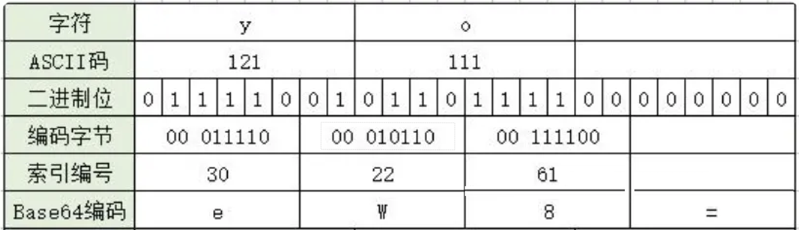
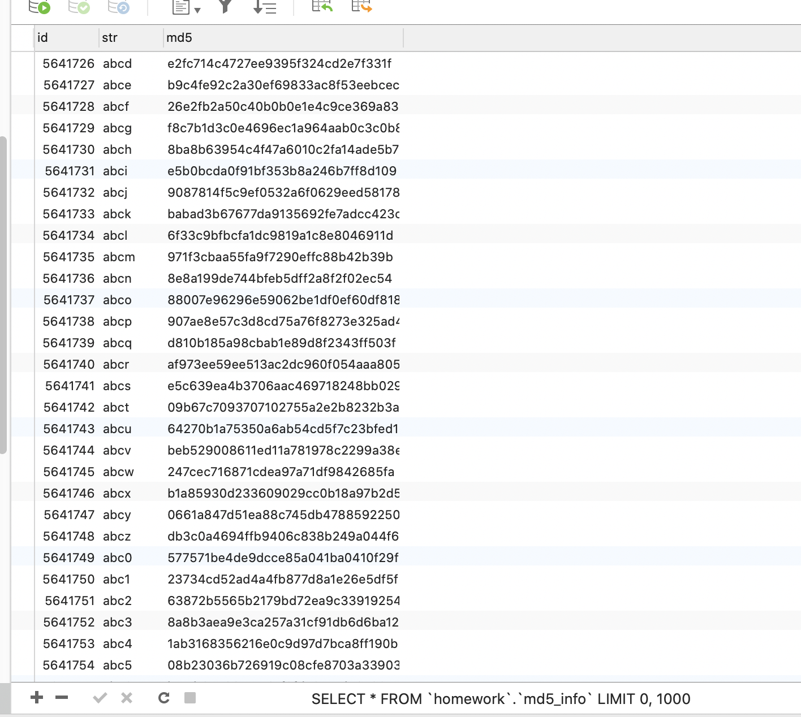
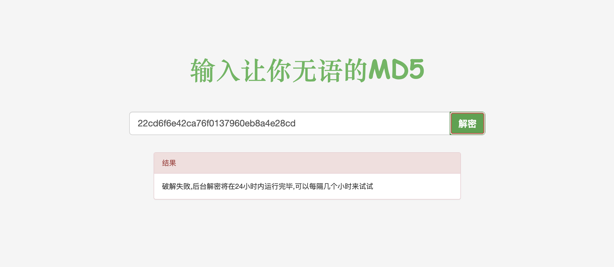

# JS逆向加密与解密

## 一、编码

### 【1】url编码

```python
import urllib.parse 

# s = 'a'
s = ' 123'
ret = urllib.parse.quote(s)
print(ret)
s = urllib.parse.unquote(ret)
print(s)

params = {'name': '张三', 'age': 20, 'address': '北京市海淀区'}
query_string = urllib.parse.urlencode(params)
print(query_string)

query_string = 'name=%E5%BC%A0%E4%B8%89&age=20&address=%E5%8C%97%E4%BA%AC%E5%B8%82%E6%B5%B7%E6%B7%80%E5%8C%BA'
params = urllib.parse.parse_qs(query_string)
print(params, type(params))
```

### 【2】 base64编码

#### （1）base64是什么

Base64编码，是由64个字符组成编码集：**26个大写字母A~Z，26个小写字母a~z，10个数字0~9，符号“+”与符号“/”**。Base64编码的基本思路是**将原始数据的三个字节拆分转化为四个字节**，然后根据Base64的对应表，得到对应的编码数据。

当原始数据凑不够三个字节时，编码结果中会使用额外的**符号“=”**来表示这种情况。

#### （2）base64原理


一个Base64字符实际上代表着6个二进制位(bit)，4个Base64字符对应3字节字符串/二进制数据。

3个字符为一组的的base64编码方式如：


小于3个字符为一组的编码方式如：



总结：base64过程


最后处理完的编码字符再转字节中不再有base64以外的任何字符。

#### （3）base64测试

```python
import base64

bs = "you".encode("utf-8")
# 把字节转化成b64
print(base64.b64encode(bs).decode())

bs = "yo".encode("utf-8")
# 把字节转化成b64
print(base64.b64encode(bs).decode())

# 猜测结果
bs = "y".encode("utf-8")
# 把字节转化成b64
print(base64.b64encode(bs).decode())


```

注意, b64处理后的字符串长度. 一定是4的倍数. 如果在网页上看到有些密文的b64长度不是4的倍数. 会报错

例如, 

```python
import base64

s = "eW91"
ret = base64.b64decode(s)
print(ret)

s = "eW91eQ=="
ret = base64.b64decode(s)
print(ret)

s = "eW91eQ"
ret = base64.b64decode(s)
print(ret)
```

解决思路. base64长度要求. 字符串长度必须是4的倍数. 填充一下即可

```python
s = "eW91eQ"
# ret = base64.b64decode(s)
# print(ret)

s += ("=" * (4 - len(s) % 4))
print("填充后", s)
ret = base64.b64decode(s).decode()
print(ret)
```

#### （4）base64变种

```python
# 方式1
data = res.text.replace("-", "+").replace("_", "/")
base64.b64decode(data)
# 方式2
data = base64.b64decode(res.text, altchars=b"-_")  # base64解码成字节流
```

#### （5）为什么要base64编码

base64 编码的优点：

- 算法是编码，不是压缩，编码后只会增加字节数（一般是比之前的多1/3，比如之前是3， 编码后是4）
- 算法简单，基本不影响效率
- 算法可逆，解码很方便，不用于私密传输。
- 加密后的字符串只有【0-9a-zA-Z+/=】 ，不可打印字符（转译字符）也可以传输（关键！！！）

有些网络传输协议是为了传输`ASCII文本`设计的，当你使用其传输二进制流时（比如视频/图片），二进制流中的数据可能会被协议错误的识别为控制字符等等，因而出现错误。那这时就要将二进制流传输编码，因为有些8Bit字节码并没有对应的ASCII字符。

比如十进制ASCII码8对应的是后退符号(backspace), 如果被编码的数据中包含这个数值，那么编码出来的结果在很多编程语言里会导致前一个字符被删掉。又比如ASCII码0对应的是空字符，在一些编程语言里代表字符串结束，后续的数据就不会被处理了。

用Base64编码因为限定了用于编码的字符集，确保编码的结果可打印且无歧义。

不同的网络节点设备交互数据需要：设备A把base64编码后的数据封装在`json字符串`里，设备B先解析json拿到value，再进行base64解码拿到想要的数据。

> 1. 早年制定的一些协议都是只支持文本设定的。随着不断发展需要支持非文本了，才搞了一个base64做兼容
>
> 2. 虽然编码之后的数据与加密一样都具有不可见性，但编码与加密的概念并不一样。编码是公开的，任何人都可以解码；而加密则相反，你只希望自己或者特定的人才可以对内容进行解密。

base64处理图片数据：

```python
import base64
source = "data:image/png;base64,iVBORw0KGgoAAAANSUhEUgAAACAAAAAgCAMAAABEpIrGAAAA7VBMVEUAAAD////////s8v////+txP+qwv+4zf/w9f/2+P+hu//Q3f+yyP+4zf/Q3f////+kvv+90P+80f+2yv/S4P/T4P/M2//z9/+cuP/V4P9Whv////9Uhf9Sg/9Pgf9NgP/8/f9di/9Xh/9lkf5aif9qlP7z9//k7P/c5v+2y/94nv51nP6lv/+LrP6Ep/6BpP5gjf7v9P+wxv/U4f/M2/+sxP+vxv73+f/P3v/J2v+5zf+ivP+fuv9xmf+Ytv6Usv6Hqf58of5vl/7m7v/g6f+zyf6QsP75+//q8P/B0v/W4//C1P6+0P6qwv6ct/76fHZiAAAAGnRSTlMAGAaVR/Py45aC9Mfy2b8t9OPZ2ce/v4L0x/e74/EAAAIZSURBVDjLZVPXYuIwEDSmQ4BLv5O0ku3Yhwu2IZTQe0hy7f8/57QSoYR5sVea1c424wgzl324LRRuH7I507hEJluYucCFEOBGhWzmy7X5+N0WwIjTbrcdBsKulM0z96onGCGE2X6n+cTkj/CqJ480igzkNXp26E9JkABSbBz8i4Bn3EkH840mKHoxs49fZQzt2Kd03FQEzSB3WsejB9Jqf1CJQBM0wCurABWBoub0gkDENwyStTHA62pwSWDtklRQ4FLfjnaiPqVW60hAYeLKNHIREOZuKTL80H6XBFCwn4BAmDOyLiOQUIlOSEjaoS+Ju57NZuul73Fml4w6yAivSLBW3MGfcfBmIegmArg3alICdJHgy1jQt8Z/6CcC4DdGXhLIoiWRACpbLYbDYW80GnXp2GH8ShP+PUvEoHsAIFq9Xm8+kXlIwkkI9pm+05Tm3yWqu9EiB0pkwjWBx2i+tND1XqeZqpPU4VhUbq/ekR8CwTRVoRxf3ifTbeIwcONNsJZ2lxFVKDMv1KNvS2zXdrnD+COvR1PQpTZKNlKD3cLCOJNnivgVxkw169BunlKFaV9/B+LQbqOsByY4IVgDB59dl/cjR9TIJV1Lh7CGqUqH/DDPhhZYOPkdLz6m0X7GrzPHsSe6zJwzxvm+5NeNi8U5ABfn7mz7zHJFrZ6+BY6rd7m8kQtcAtwwXzq4n69/vZbP1+pn6/8fsrRmHUhmpYYAAAAASUVORK5CYII="
s = source.split(",")[1]
with open("a.png", "wb") as f:
    f.write(base64.b64decode(s))
```

J的base64编码与解码

```js
// 编码
btoa()
// 解码
atob()
```

## 二、摘要&加密算法

###  【1】摘要算法：一切从MD5开始

MD5是一个非常常见的摘要(hash)逻辑.  其特点就是小巧. 速度快. 极难被破解. 所以, md5依然是国内非常多的互联网公司选择的密码摘要算法. 

> 1. 不可逆. 所以. 摘要算法就不是一个加密逻辑. 
> 2. 相同的内容计算出来的摘要是一样的，不同的内容(哪怕是一丢丢丢丢丢不一样) 计算出来的结果差别非常大
> 3. 结果的长度是固定的，跟算法有关系，算法越复杂，越长！
> 4. 一般MD5值是32位由数字“0-9”和字母“a-f”所组成的字符串

在数学上. 摘要其实计算逻辑就是hash. 

hash(数据)  => 数字

 	1. 密码
 	2. 一致性检测  

md5的python实现:

```python
from hashlib import md5

obj = md5()
obj.update("yuan".encode("utf-8"))
# obj.update("alex".encode('utf-8'))  # 可以添加多个被加密的内容

bs = obj.hexdigest()
print(bs)
```


我们把密文丢到网页里. 发现有些网站可以直接解密. 但其实不然. 这里并不是直接解密MD5. 而是"撞库". 

就是它网站里存储了大量的MD5的值. 就像这样:



而需要进行查询的时候. 只需要一条select语句就可以查询到了. 这就是传说中的撞库. 

如何避免撞库: md5在进行计算的时候可以加盐. 加盐之后. 就很难撞库了. 

```python
from hashlib import md5

salt = "我是盐.把我加进去就没人能破解了"
obj = md5(salt.encode("utf-8"))  # 加盐
obj.update("alex".encode("utf-8"))

bs = obj.hexdigest()
print(bs)
```



扩展; sha256

```python
from hashlib import sha1, sha256
sha = sha256(b'salt')
sha.update(b'alex')
print(sha.hexdigest())
```

不论是sha1, sha256, md5都属于摘要算法. 都是在计算hash值. 只是散列的程度不同而已. 这种算法有一个特性. 他们是散列. 不是加密. 而且, 由于hash算法是不可逆的, 所以不存在解密的逻辑.

### 【2】对称加密（AES与DES）

AES是一种对称加密，所谓对称加密就是加密与解密使用的秘钥是一个。

常见的对称加密: AES, DES, 3DES. 我们这里讨论AES。

安装：

```python
pip install pycryptodome
```

AES 加密最常用的模式就是 CBC 模式和 ECB模式 ，当然还有很多其它模式，他们都属于AES加密。ECB模式和CBC 模式俩者区别就是 ECB 不需要 iv偏移量，而CBC需要。

```apl
"""
key的长度
    16: *AES-128*   
    24: *AES-192*
    32: *AES-256*

iv的字节长度只能是16位

MODE 加密模式. 
    常见的ECB, CBC
    ECB：是一种基础的加密方式，密文被分割成分组长度相等的块（不足补齐），然后单独一个个加密，一个个输出组成密文。
    CBC：是一种循环模式，前一个分组的密文和当前分组的明文异或或操作后再加密，这样做的目的是增强破解难度。
"""
```

CBC加密案例（选择aes-128）：

```python
from Crypto.Cipher import AES
from Crypto.Util.Padding import pad
import base64

key = '0123456789abcdef'.encode()  # 秘钥: 因为aes-128模式，所以必须16字节
iv = b'abcdabcdabcdabcd'  # 偏移量：因为aes-128模式，所以必须16字节
text = 'alex is a monkey!'  # 加密内容，因为aes-128模式，所以字节长度必须是16的倍数
# while len(text.encode('utf-8')) % 16 != 0:  # 如果text不足16位的倍数就用空格补足为16位
#     text += '\0'
text = pad(text.encode(), 16)
print("完整text:", text)

aes = AES.new(key, AES.MODE_CBC, iv)  # 创建一个aes对象

en_text = aes.encrypt(text)  # 加密明文
print("aes加密数据:::", en_text)  # b"_\xf04\x7f/R\xef\xe9\x14#q\xd8A\x12\x8e\xe3\xa5\x93\x96'zOP\xc1\x85{\xad\xc2c\xddn\x86"

en_text = base64.b64encode(en_text).decode()  # 将返回的字节型数据转进行base64编码
print(en_text)  # X/A0fy9S7+kUI3HYQRKO46WTlid6T1DBhXutwmPdboY=
```

CBC解密案例：

````python
from Crypto.Cipher import AES
import base64
from Crypto.Util.Padding import unpad

key = '0123456789abcdef'.encode()
iv = b'abcdabcdabcdabcd'
aes = AES.new(key, AES.MODE_CBC, iv)

text = 'X/A0fy9S7+kUI3HYQRKO46WTlid6T1DBhXutwmPdboY='.encode()  # 需要解密的文本
ecrypted_base64 = base64.b64decode(text)  # base64解码成字节流
source = aes.decrypt(ecrypted_base64)  # 解密
print("aes解密数据:::", source.decode())
print("aes解密数据:::", unpad(source, 16).decode())
````

> 1. 在Python中进行AES加密解密时，所传入的密文、明文、秘钥、iv偏移量、都需要是bytes（字节型）数据。python 在构建aes对象时也只能接受bytes类型数据。
> 2. 当秘钥，iv偏移量，待加密的明文，字节长度不够16字节或者16字节倍数的时候需要进行补全。
>
> 3. CBC模式需要重新生成AES对象，为了防止这类错误，无论是什么模式都重新生成AES对象就可以了。

### 【3】非对称加密(RSA)

非对称加密. 加密和解密的秘钥不是同一个秘钥. 这里需要两把钥匙. 一个公钥, 一个私钥.  公钥发送给客户端. 发送端用公钥对数据进行加密. 再发送给接收端, 接收端使用私钥来对数据解密. 由于私钥只存放在接受端这边. 所以即使数据被截获了. 也是无法进行解密的. 

[公钥和私钥](https://blog.csdn.net/Ruishine/article/details/114705443)

常见的非对称加密算法: RSA, DSA等等, 我们就介绍一个. RSA加密, 也是最常见的一种加密方案

1. 创建公钥和私钥

```python
from Crypto.PublicKey import RSA

# 生成秘钥
rsakey = RSA.generate(1024)
with open("rsa.public.pem", mode="wb") as f:
    f.write(rsakey.publickey().exportKey())

with open("rsa.private.pem", mode="wb") as f:
    f.write(rsakey.exportKey())
```

2. 加密

```python
from Crypto.PublicKey import RSA
from Crypto.Cipher import PKCS1_v1_5
import base64


# 加密
data = "我喜欢你"
with open("rsa.public.pem", mode="r") as f:
    pk = f.read()
    rsa_pk = RSA.importKey(pk)
    rsa = PKCS1_v1_5.new(rsa_pk)

    result = rsa.encrypt(data.encode("utf-8"))
    # 处理成b64方便传输
    b64_result = base64.b64encode(result).decode("utf-8")
    print(b64_result)

```

3. 解密

```python
from Crypto.PublicKey import RSA
from Crypto.Cipher import PKCS1_v1_5
import base64

data = "BkiKG8jzVGzbWOl4m8NXJEYglgtxhOB05MGmap8JSP97GzoewPBmDTs7c5iACUof3k/uJf0H88GygajVgBvkcbckJp7oO+Qj6VSUQYTOHhKN/VG2a8v+WzL34EO/S7BYoj2oOxIDAr8wDLxYxjBeXq/Be6Q1yBbnZcKaMkifhP8="
# 解密
with open("rsa.private.pem", mode="r") as f:
    prikey = f.read()
    rsa_pk = RSA.importKey(prikey)
    rsa = PKCS1_v1_5.new(rsa_pk)
    result = rsa.decrypt(base64.b64decode(data), None)
    print("rsa解密数据:::", result.decode("utf-8")
```

### 【4】JS版本的加密算法

#### （1）md5摘要算法

```js
const CryptoJS = require('crypto-js');
// 原始数据
const data = '123456';
// 生成MD5摘要
const md5Digest = CryptoJS.MD5(data).toString();

console.log(md5Digest);
```

#### （2）AES加密

```js
const CryptoJS = require("crypto-js")

// 密钥（128位，16字节）
var key = CryptoJS.enc.Utf8.parse('0123456789abcdef');

// 初始化向量（IV）（128位，16字节）
var iv = CryptoJS.enc.Utf8.parse('1234567890abcdef');

// 待加密的数据
var plaintext = 'Hello, yuan!';

// 进行AES-128加密，使用CBC模式和PKCS7填充
var encrypted = CryptoJS.AES.encrypt(plaintext, key, {
    iv: iv,
    mode: CryptoJS.mode.CBC,
    padding: CryptoJS.pad.Pkcs7
});

// 获取加密后的密文
var ciphertext = encrypted.toString();

console.log(ciphertext);
```

