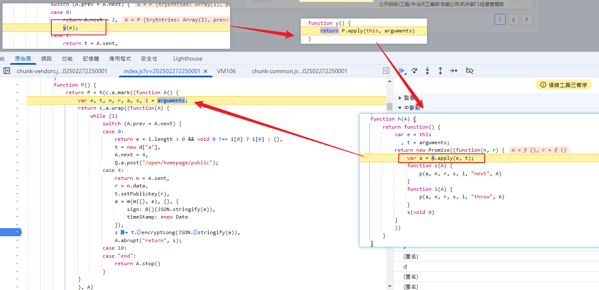

爬蟲筆記

# #00、爬蟲小工具

1. 斷點
2. 關鍵字搜索和請求堆棧
3. 扣JS(JS函數和必包環境等)
4. webpack閉包
5. 補環境(瑞數案例)
6. 混淆與解混淆
7. 微信小程序
8. 指紋
9. 滑塊

## # 0.0、關鍵字查詢定位

### # 0.0.1 方法關鍵字

~~~
encrypt( 請求
decrypt( 回應
JSON.stringify
JSON.parse
~~~

### # 0.0.2	headers關鍵字


### # 0.0.3	攔截器關鍵字

~~~
interceptors.request.use( #請求
interceptors.response.use( # 回應
interceptors.response.forEach(
n.then(t.shift(), t.shift()
~~~


### # 0.0.4	路徑關鍵字


### # 0.0.5  XHR/Fetch中斷點


## #0.1、AES 解密工具

## #0.2、python 調用 JS

~~~python
import execjs
# 打開js文件
js_compile = execjs.compile(open("main.js",'r', encoding='utf-8').read())
# 使用js文件的方法 及參數
js_compile.call("encrypt", page)
js_compile.call("decrypt", res)
~~~


## #0.3、代理監控吐環境補環境

~~~python
function setProxyArr(proxyObjArr) {
    for (let i = 0; i < proxyObjArr.length; i++) {
        const handler = `{
            get: function(target, property, receiver) {
                console.log("方法:", "get  ", "对象:", "${proxyObjArr[i]}", "  属性:", property, "  属性类型：", typeof property, ", 属性值：", target[property], ", 属性值类型：", typeof target[property]);
                return target[property];
            },
            set: function(target, property, value, receiver) {
                console.log("方法:", "set  ", "对象:", "${proxyObjArr[i]}", "  属性:", property, "  属性类型：", typeof property, ", 属性值：", value, ", 属性值类型：", typeof target[property]);
                return Reflect.set(...arguments);
            }
        }`;
        eval(`try {
            ${proxyObjArr[i]};
            ${proxyObjArr[i]} = new Proxy(${proxyObjArr[i]}, ${handler});
        } catch (e) {
            ${proxyObjArr[i]} = {};
            ${proxyObjArr[i]} = new Proxy(${proxyObjArr[i]}, ${handler});
        }`);
    }
}
~~~

~~~js
setProxyArr(["window", "document", "navigator", "script", "canvas", "ctx", "head", "document.all"])
~~~


## #0.4、 JS注入找加密與解密

~~~javascript
var my_parse = JSON.parse;
JSON.parse = function (params) {
    console.log("JSON.parse", params);
    debugger
    return my_parse(params);
};
~~~

## # 0.5、 使用 subprocess 模塊


1.  在js 使用  process.argv[0] 傳入參數

   ~~~js
   console.log("process.argv >>>",process.argv)
   console.log("process.argv >>>",process.argv[0])
   ~~~

   

2. 使用 node 命令

   ~~~sh
   node test.js ssss
   ~~~

   

3. 在 python 寫

   ~~~python
   import subprocess
   def get_encrypt_pwd(params):
       # 使用node命令 python 調用JS
       ret = subprocess.check_output(f"node ./encrypt.js {params}", shell=True).decode().strip()
       # print(ret)
       return ret
   ~~~

   

4. xx


# # 01、加密與解密


## A、Base64編碼

~~~python
import base64

from Crypto.Cipher import AES
from Crypto.Util.Padding import pad, unpad

b64_encrypt_data = "mV0aGkGH6g3kyMHSaqEeG9HA7CwOHsnv20X/BiUAzYs="

# (1) 解码base64

encrypt_data = base64.b64decode(b64_encrypt_data)
print("encrypt_data:::",encrypt_data)

# (2) 解密：算法和什么钥匙
key = b"g\x1a\x99\x95\xa2\x17\xb7\xe79\x88\x86\x8dT\x94\x98'"
iv = b"g\x1b\x99\x95\xa3\x17\xb7\xe79\x88\x86\x8dT\x94\x98'"
aes_obj = AES.new(key=key, mode=AES.MODE_CBC, iv=iv)

data = aes_obj.decrypt(encrypt_data)

data = unpad(data,16).decode()
print("data:::",data)
~~~


## B、加密算法(AES,DES,RSA)  可逆

### a、AES

#### 加密

~~~python
import base64

from Crypto.Cipher import AES
from Crypto.Util.Padding import pad, unpad

# (1) 确认key和iv必须保证是16或者24，或者32
key = "0123456789123456".encode()
iv = "asdfghjklzxcvbnm".encode()

# (2) 构建一个aes对象
aes = AES.new(key, AES.MODE_CBC, iv)

# (3) 对数据加密
# 数据一定要是16或者24或者32的倍数
text = 'alex is a stupid donkey!'.encode()
# text = '{"a":"apple","b":"banana"}'.encode()
print(len(text))
text_bytes = pad(text, 16)# 数据一定要是16或者24或者32的倍数
print("text_bytes:", text_bytes)
encrypt_data = aes.encrypt(text_bytes)

print("encrypt_data:::", encrypt_data)


# (4) base64编码
base64_encrypt_data = base64.b64encode(encrypt_data).decode()
print("base64_encrypt_data:",base64_encrypt_data)

~~~


#### 解密

~~~python
import base64
import json
from Crypto.Util.Padding import pad, unpad

from Crypto.Cipher import AES

base64_encrypt_data = "BiudTnAOjswHFg+/aqDsp2yOD2Ncuq987hPO5CTW36A="

# 一、 base64的解码

encrypt_data = base64.b64decode(base64_encrypt_data)
print("encrypt_data:", encrypt_data)

# 二、解密数据
# (1) 确认key和iv必须保证是16或者24，或者32
key = "0123456789123456".encode()
iv = "asdfghjklzxcvbnm".encode()
# (2) 构建一个aes对象
aes = AES.new(key, AES.MODE_CBC, iv)

# (3) 对数据解密
data = aes.decrypt(encrypt_data)
print(data)
# print(data.decode())
# data = unpad(data, 16)
# print("data:", data.decode())

# print(json.loads(data.decode()))
~~~


### b、DES

### c、RSA

#### 生成公鑰和私鑰

~~~python
from Crypto.PublicKey import RSA

# rsa_key = RSA.generate(1024)
# print(rsa_key)
#
# print("private key:",rsa_key.exportKey())
# print("public key:",rsa_key.publickey().exportKey())

# 生成秘钥
rsakey = RSA.generate(1024)
with open("rsa.public.pem", mode="wb") as f:
    f.write(rsakey.publickey().exportKey())

with open("rsa.private.pem", mode="wb") as f:
    f.write(rsakey.exportKey())

~~~


#### 公鑰加密數據

~~~python
import base64

from Crypto.PublicKey import RSA
from Crypto.Cipher import PKCS1_v1_5

data = "我喜欢你"

with open("rsa.public.pem", mode="r") as f:
    pk = f.read()
    print("pk:", pk)

# (1) 钥匙对象
key_obj = RSA.importKey(pk)
# (2) rsa算法对象
rsa = PKCS1_v1_5.new(key_obj)
# (3) 数据加密
encrypt_data = rsa.encrypt(data.encode())
print("encrypt_data:", encrypt_data)
# (4) base64处理
base64_encrypt_data = base64.b64encode(encrypt_data).decode()
print("base64_encrypt_data:", base64_encrypt_data)

~~~


#### rsa的解密數據

~~~python
import base64
from Crypto.PublicKey import RSA
from Crypto.Cipher import PKCS1_v1_5

base64_encrypt_data = "BVwWbGGJeAQPwBZ55NKtC5KpErG12m/WjWkItq5rbDmuDSdr3RheLsTYA43Kstl5uXwuuDAH1UdoH187RK91VtEPK5I2nTIuHQhzEJiZGsJ/bYsSWKQSyyOsCJawJa0c6GB6yBJHVTBd7Qcfo/D9wUJAfH0Aip8MpRbNVnwUTm8="

# 一、 base64的解码

encrypt_data = base64.b64decode(base64_encrypt_data)

# 二、解密数据

with open("rsa.private.pem", mode="r") as f:
    pk = f.read()
    # (1) 构建私钥钥匙对象
    pk = RSA.importKey(pk)
    # (2) 构建rsa算法对象
    rsa = PKCS1_v1_5.new(pk)
    # (3) 算法解密
    data = rsa.decrypt(encrypt_data, None)
    print("data:",data.decode())

~~~


## C、摘要算法(md5,sha1,sha256)   可加 salt

### a、md5  不可逆

- 不可逆、所以【摘要算法】就不是一個加密邏輯
- 相同的內容計算出來的摘要是一樣的，不同的內容計算出來的結果差別非常大
- 結果的長度是固定的，跟算法有關係，算法越複雜，越長
- 一般MD5值是32位元由數字0~9和字母a-f所組成的字串

##### 必背 md5 123456

'e10adc3949ba59abbe56e057f20f883e'

e10...83e


##### 範例

~~~python
from hashlib import md5

obj = md5()
obj.update("yuan".encode("utf-8"))
# obj.update("alex".encode('utf-8'))  # 可以添加多个被加密的内容

bs = obj.hexdigest()
print(bs)
~~~

加鹽

~~~python
from hashlib import md5

salt = "我是盐.把我加进去就没人能破解了"
obj = md5(salt.encode("utf-8"))  # 加盐
obj.update("alex".encode("utf-8"))

bs = obj.hexdigest()
print(bs)
~~~


### b、sha1

### c、sha256

#### 

~~~python
from hashlib import sha256
s = sha256()
s.update(params["body"].encode())

body = s.hexdigest()
~~~


~~~python
from hashlib import sha1, sha256
sha = sha256(b'salt')
sha.update(b'alex')
print(sha.hexdigest())
~~~


# # 02 、補環境

# # 03、webpack

~~~
关于webpack的重点：

    1. 认识或者非常熟练加载器函数的结构
        function n(r) {
        if (t[r])
            return t[r].exports;
        var o = t[r] = {
            i: r,
            l: !1,
            exports: {}
        };
        e[r].call(o.exports, o, o.exports, n);
        return o.exports.exports;
    }

    2. 理解调度逻辑

    3. 监控模块执行：
        e[r].call(o.exports, o, o.exports, n)之前打印r

    4. 学会注释一些无谓的初始化的动作
~~~


### 0.3.0	程式規範

#### main.js

執行程式

#### loader.js 

放入webpack JS

#### env.js	

放入 需要補環境的JS

#### main.py

執行python程式

### 0.3.1	筆記

1. 找加載器對應的文件
2. 注解初始化動作，少補環境
3. 全局調用加載器函數
4. 打上執行模塊日志

### 0.3.2	樣式

~~~javascript
/*
!function(形参){加载器}([模块1，模块2,...])

!function(形参){加载器}({"k1":"模块1","k2":"模块2"}) 
*/
~~~

### 0.3.3	加載器函數

~~~javascript
    function n(r) {
        if (t[r])
            return t[r].exports;
        var o = t[r] = {
            i: r,
            l: !1,
            exports: {}
        };
        e[r].call(o.exports, o, o.exports, n);
        return o.exports.exports; 
    }
~~~


### 0.3.4 範例

- digikey
- 喜馬拉雅

## 摳JS

## 0.4 逆向爬蟲之補環境專題

~~~
补环境：利用两个执行环境(node.js和浏览器)的构造不同
node.js: ECMA 网络接口 文件操作 数据库接口
浏览器:   ECMA BOM DOM

定位的JS代码（加密值的逻辑代码中）有可能两情况需要补环境：
(1) 正常的前段初始化或数据准备
(2) 前端环境的校验
    -- 校验是否是浏览器环境


    // 版本1
    navigator = {
         userAgent:'Mozilla/5.0 (Macintosh; Intel Mac OS X 10_15_7) AppleWebKit/537.36 (KHTML, like Gecko) Chrome/127.0.0.0 Safari/537.36'
    }

    if navigator.userAgent:
       // 正常进行
    else{
       // 不是浏览器环境
       // 报错或生成一个的假的值
    }
    // 版本2

    navigator = {}

    if navigator.toString()==='[object Navigator]':
       // 正常进行
    else{
       // 不是浏览器环境
       // 报错或生成一个的假的值
    }

    -- 校验是否是非浏览器环境
    // 版本3:判断是否是node.js
    if process || global:
        // 不是浏览器环境
       // 报错或生成一个的假的值
    else{
       // 正常进行
    }
~~~


# # 04、瑞數 6

## # 04.1、特點

1. 有兩個相同前綴的KEY name 最後一個字母不同


# # 05、滑塊


# # 06 、AST


# # 07、cookie 逆向

## cookie 加密：

- 時效性參數
- 每次都是需要更新的 動態參數
  - ​			

## cookie是在那裡生成:

- ​	頁面當中的document(dom)--->(window)
- ​	document['cookie']=xxx

## 加密參數:js的某一個方法或者函數生成

- ​	get_cookie(cookie)	從服務器獲取cookie
- ​	set_cookie(cookie)    生成cookie進行賦值

## JS逆向加密定位

關鍵字搜索

堆棧分析	找不到cookie

hook(監聽DOM對象當中的cookie進行set操作 debugger)

#  # 08、登入帳號密碼

# 範例整理

|      |          代號          | url                                                          | 帳密 | 加解密 | 瑞數 | webpack | 滑塊 | AST  |      |      |      |
| ---- | :--------------------: | :----------------------------------------------------------- | ---- | ------ | ---- | ------- | ---- | ---- | ---- | ---- | ---- |
|      |  [01](# 01.艾曼指數)   | [艾曼指數](https://www.chinaindex.net/ranklist/4)            |      | Y      |      |         |      |      |      |      |      |
|      |   [02](# 02.醫保局)    | [醫保局](https://fuwu.nhsa.gov.cn/nationalHallSt/#/search/disease-diagnosis?code=90000&flag=false&gbFlag=true) |      |        |      | Y       |      |      |      |      |      |
|      |   [03](# 03.digikey)   | [digikey](https://www.digikey.com/en/products/filter/coaxial-cables/x02rf/456) |      |        |      | Y       |      |      |      |      |      |
| *    |   [04](#04.喜馬拉雅)   | [喜馬拉雅](https://passport.ximalaya.com/page/web/login?fromUri=https%3A%2F%2Fstudio.ximalaya.com%2Fupload) | Y    | Y      |      | Y       | Y    |      |      |      |      |
|      |  [05](# 05.中文期刊)   | [中文期刊](https://qikan.cqvip.com/Qikan/Journal/JournalGuid) |      |        | Y    |         |      |      |      |      |      |
| X    | [06](# 06.熱搜時光機)  | [熱搜時光機](https://www.weibotop.cn/2.0/)                   |      |        |      |         |      |      |      |      |      |
| ??   | [07](#  07.CoinGlass ) | [Coin Glass](https://www.coinglass.com/zh)                   |      | Y      |      | Y       |      |      |      |      |      |
|      |  [08](# 08.數位觀察)   | [數位觀察](https://www.swguancha.com/)                       |      |        |      | Y       |      |      |      |      |      |
|      |   [09](# 09.級志願)    | [級志願](https://www.jizhy.com/44/rank/school)               |      |        |      |         |      |      |      |      |      |
|      |   [10](# 10.優志願)    | [優志願](https://www.youzy.cn/)                              |      |        |      |         |      |      |      |      |      |
|      |  [11](# 11.阿兒法營)   | [阿兒法營](https://aerfaying.com/)                           |      |        |      |         |      |      |      |      |      |
|      |  [12](# 12.中遠	)   | [中遠](https://synconhub.coscoshipping.com/)                 |      |        |      |         |      |      |      |      |      |
|      |  [13](# **13.五礦**)   | [五礦](https://ec.minmetals.com.cn/open/home/purchase-info)  |      |        |      |         |      |      |      |      |      |
|      |  [14](# 14 蜂鳥競技)   | [蜂鳥競技](https://www.fnscore.cn/score/)                    |      |        |      |         |      |      |      |      |      |
|      |    [15](# 15.京東)     | [京東](https://search.jd.com/)                               |      |        |      |         |      |      |      |      |      |
|      |   [16](# 16.產權局)    | [產權局](http://epub.cnipa.gov.cn/)                          |      |        |      |         |      |      |      |      |      |
|      |   [17](# 17.比價器)    | [比價器](https://www.bijiaqi.com/)                           |      |        |      |         |      |      |      |      |      |
|      |  [18](# 18.白雲機場)   | [白雲機場](https://www.baiyunairport.com/flight/dep)         |      |        |      |         |      |      |      |      |      |
| O    |   [19](# 19.逗遊網)    | [逗遊網](https://www.doyo.cn/passport/login?next=https://www.doyo.cn/) |      |        |      |         |      |      |      |      |      |
|      |  [20](# 20.點點數據)   | [點點數據](https://app.diandian.com/)                        |      |        |      |         |      |      |      |      |      |
|      |   [21](# 21.天翼雲)    | [天翼雲](https://m.ctyun.cn/wap/main/auth/login)             |      |        |      |         |      |      |      |      |      |
|      |  [22](# 22. 貓眼電影)  | [貓眼電影](https://www.maoyan.com/films)                     |      |        |      |         |      |      |      |      |      |
|      |          [23]          |                                                              |      |        |      |         |      |      |      |      |      |
|      |          [24]          |                                                              |      |        |      |         |      |      |      |      |      |
|      |          [25]          |                                                              |      |        |      |         |      |      |      |      |      |
|      |          [26]          |                                                              |      |        |      |         |      |      |      |      |      |
|      |          [27]          |                                                              |      |        |      |         |      |      |      |      |      |
|      |          [28]          |                                                              |      |        |      |         |      |      |      |      |      |
|      |          [29]          |                                                              |      |        |      |         |      |      |      |      |      |
|      |          [30]          |                                                              |      |        |      |         |      |      |      |      |      |
|      |          [31]          |                                                              |      |        |      |         |      |      |      |      |      |
|      |          [32]          |                                                              |      |        |      |         |      |      |      |      |      |
|      |          [33]          |                                                              |      |        |      |         |      |      |      |      |      |
|      |          [34]          |                                                              |      |        |      |         |      |      |      |      |      |
|      |          [35]          |                                                              |      |        |      |         |      |      |      |      |      |
|      |          [36]          |                                                              |      |        |      |         |      |      |      |      |      |
|      |          [37]          |                                                              |      |        |      |         |      |      |      |      |      |


# 01.艾曼指數

8期 23

### JS逆向加密與解密

0.1	關鍵字搜尋

0.2	JS逆向加密與解密

## 1.1	訪問頁面

https://www.chinaindex.net/ranklist/4


## 1.2請求回應

### 1.2.1	請求


### 1.2.2	預覽


### 1.2.3	響應


## 1.3	步驟

請求加密

回應加密

### 1.3.1	使用關鍵字查找

1. interceptors.response.use (

   

2. decrypt( 

   


### 1.3.2	解密

有 IV 就是 AES 加密算法的CBC算法


### 1.3.3	找AES的 KEY值


# 02.醫保局	

https://fuwu.nhsa.gov.cn/nationalHallSt/#/search/disease-diagnosis?code=90000&flag=false&gbFlag=true

### webpack逆向

## 2.1	訪問頁面


https://fuwu.nhsa.gov.cn/nationalHallSt/#/search/pharmacies?code=90000&flag=false&gbFlag=true

## 2.2	請求回應

### 2.2.1	請求	


### 2.2.2	預覽


### 2.2.3	響應


## 2.3 	響應解密

### 2.3.1	入口定位

#### 方法一 interceptors.response.use(


#### 方法二	decrypt(


使用請求堆棧


找到

~~~javascript
return e.data.data.appCode && (e.data.data = Object(u.b)("SM4", e.data)),
~~~


### 2.3.1	基於webpack逆向解密

#### 找加載器對應的文件


#### 註解初始化動作


#### 全局調用加載器函數


```javascript
console.log(window.test)
```

#### 打上執行模塊日志


#### 解密數據測試


## 2.4	請求加密

### 2.4.1	入口定位


### 2.4.2	逆向加密

encrypt(


找到u就是webpack


# 03.digikey	

https://www.digikey.com/en/products/filter/coaxial-cables/x02rf/456


1. 載荷 加密值

   

2. api/v5/filter-page  使用路徑關鍵字 找到入口定位

   

3. 到達目標 判斷 c

   

4. 進入createSParam

   

5. 找加密方法

   

6. xx

7. 

8. x

9. xx

10. x

11. xx

12. x

13. 


# 04.喜馬拉雅

【8期day28,29】

https://passport.ximalaya.com/page/web/login?fromUri=https%3A%2F%2Fstudio.ximalaya.com%2Fupload

六期Day28-29

19131640303

### webpack

## 04.01	流程


### 加密入口

1. 登入帳密

   

2. 滑塊

   

3. 看載荷數據

   

4. 使用關鍵字查詢 account:

   

5. 找到加密入口

   

### webpack方式

1. 找webpack入口

   

2. 進入webpack入口

   

3. 找缺少的文件

   

4. 找覆值的文件

   __award_library__

   

   


需要移除 var

### 深入補環境

1.  document  createElement

   方法: get   对象: document   属性: createElement   属性类型： string , 属性值： undefined , 属性值类型： undefined

   

2. canvas

3. navigator

4. div


## 04.02	CODE


# 05.中文期刊

【8期day 29,30】

https://qikan.cqvip.com/Qikan/Journal/JournalGuid

### 瑞數6

[範例整理](# 範例整理)

## 5.1	訪問頁面

## 5.2	請求回應

5.2.1	請求	

5.2.2	預覽

5.2.3	響應


# 06.熱搜時光機

【七期Day13-14】

https://www.weibotop.cn/2.0/

[範例整理](# 範例整理)

# 07.CoinGlass 

【七期Day13-14】

webpack

六期25

[範例整理](# 範例整理)

https://www.coinglass.com/zh


# 08.數位觀察

【七期Day15-16】

https://www.swguancha.com/

[範例整理](# 範例整理)

## 加密與解密

## 08.1 流程


1. 找入口

   

2. 載荷

   

3. 響應

   

4. decrypt

   

5. key

   

## 08.2 code

~~~
import requests
import base64
from Crypto.Cipher import AES
from Crypto.Util.Padding import unpad
headers = {
    'Accept': 'application/json, text/plain, */*',
    'Accept-Language': 'zh-TW,zh;q=0.9,en-US;q=0.8,en;q=0.7',
    'Connection': 'keep-alive',
    'Content-Type': 'application/json;charset=UTF-8',
    'Origin': 'https://www.swguancha.com',
    'Referer': 'https://www.swguancha.com/',
    'Sec-Fetch-Dest': 'empty',
    'Sec-Fetch-Mode': 'cors',
    'Sec-Fetch-Site': 'same-site',
    'User-Agent': 'Mozilla/5.0 (Windows NT 10.0; Win64; x64) AppleWebKit/537.36 (KHTML, like Gecko) Chrome/133.0.0.0 Safari/537.36',
    'deviceType': '1',
    'sec-ch-ua': '"Not(A:Brand";v="99", "Google Chrome";v="133", "Chromium";v="133"',
    'sec-ch-ua-mobile': '?0',
    'sec-ch-ua-platform': '"Windows"',
}

json_data = {
    'size': 6,
    'current': 4,
    'propertyCode': [
        'DISTRICT_PROP_GJ025_RJDQSCZZ',
        'DISTRICT_PROP_GJ117_NMSYGGQDCYYCLS',
        'DISTRICT_PROP_GJ001_NMHJRK',
    ],
    'dimensionTime': '2019',
    'levelType': 2,
}

response = requests.post('https://app.swguancha.com/client/v1/cPublic/consumer/baseInfo', headers=headers, json=json_data)

# print(response.text)
# 解密
# (1) 解码base64

encrypt_data = base64.b64decode(response.text)
# print("encrypt_data:::", encrypt_data)

# (2) 解密：算法和什么钥匙
key = "QV1f3nHn2qm7i3xrj3Y9K9imDdGTjTu9".encode()

aes_obj = AES.new(key=key, mode=AES.MODE_ECB)

data = aes_obj.decrypt(encrypt_data)
data = unpad(data, 16).decode()
print("data:::", data)

~~~


# 09.級志願

【七期Day15-16】

https://www.jizhy.com/44/rank/school

[範例整理](# 範例整理)

# 10.優志願

【七期Day15-16】

https://www.youzy.cn/

[範例整理](# 範例整理)

# 11.阿兒法營

【七期Day17-18】

https://aerfaying.com/

[範例整理](# 範例整理)


# 12.中遠	

【七期Day17-18】

https://synconhub.coscoshipping.com/

[範例整理](# 範例整理)

# **13.五礦**

【七期Day17-18】

https://ec.minmetals.com.cn/open/home/purchase-info

[範例整理](# 範例整理)

1. 點擊 下頁 有兩個請求

   

2. public 

   

3. by-lx-page

   

4. by-lx-page 標頭

   

5. 使用路徑關鍵字查詢

    

6. 看到 X.sent 就會有 X.next   並進入 上一層方法

   

7. 找到加密入口

   

8. 往上找 需要的文件  

   

9. 找到 webpack

   

10. xxx

# 14 蜂鳥競技

【七期Day17-18】

https://www.fnscore.cn/score/

[範例整理](# 範例整理)

# 15.京東

【七期Day19-20】

https://search.jd.com/

[範例整理](# 範例整理)

# 16.產權局

【七期Day21】

http://epub.cnipa.gov.cn/

[範例整理](# 範例整理)


1. 清除cookie : 應用  >清除所有 cookie
2. debugger :使用事件監聽器>腳本
3. 找ts文件
4. 找 auto 文件
5. 找啟動文件 並使用替換 : 元代碼/來源>替換內容

env

ts

auto


auto 


在auo找 call 入口  eval

再用單步debugger


動態文件 需要文件替換

因 ts 和auto都會變


# 17.比價器 

【六期 Day23】

https://www.bijiaqi.com/

[範例整理](# 範例整理)

# 18.白雲機場

[範例整理](# 範例整理)

https://www.baiyunairport.com/flight/dep


# 19.逗遊網

【六期Day23】

https://www.doyo.cn/passport/login?next=https://www.doyo.cn/

https://www.doyo.cn/User/Passport/login

[範例整理](# 範例整理)

1. 找接口

   

2. 找 password密碼加密入口

   

3. 找ts 及nonce

   

4. 驗證 sh1 是否有加鹽

code

main

~~~py
import requests
import execjs

cookies = {
    'acw_tc': 'b4a3921717424581020934999ea5ea9132944f62dbc643e16683f8d004',
    'cdn_sec_tc': 'b4a3921717424581020934999ea5ea9132944f62dbc643e16683f8d004',
    'PHPSESSID': 'fn5eecj62kd5fem4gfkno7sms7',
    'doyo_www_uv_mark': 'true',
    'Hm_lvt_b0affa74a0ef00f793803b2ae8a25f8a': '1740364806,1741141126,1742458104',
    'HMACCOUNT': '7A624091589885F1',
    'Hm_lpvt_b0affa74a0ef00f793803b2ae8a25f8a': '1742458120',
}

headers = {
    'Accept': 'application/json, text/javascript, */*; q=0.01',
    'Accept-Language': 'zh-TW,zh;q=0.9,en-US;q=0.8,en;q=0.7',
    'Cache-Control': 'no-cache',
    'Connection': 'keep-alive',
    'Pragma': 'no-cache',
    'Referer': 'https://www.doyo.cn/passport/login?next=https://www.doyo.cn/',
    'Sec-Fetch-Dest': 'empty',
    'Sec-Fetch-Mode': 'cors',
    'Sec-Fetch-Site': 'same-origin',
    'User-Agent': 'Mozilla/5.0 (Windows NT 10.0; Win64; x64) AppleWebKit/537.36 (KHTML, like Gecko) Chrome/134.0.0.0 Safari/537.36',
    'X-Requested-With': 'XMLHttpRequest',
    'sec-ch-ua': '"Chromium";v="134", "Not:A-Brand";v="24", "Google Chrome";v="134"',
    'sec-ch-ua-mobile': '?0',
    'sec-ch-ua-platform': '"Windows"',
    # 'Cookie': 'acw_tc=b4a3921717424581020934999ea5ea9132944f62dbc643e16683f8d004; cdn_sec_tc=b4a3921717424581020934999ea5ea9132944f62dbc643e16683f8d004; PHPSESSID=fn5eecj62kd5fem4gfkno7sms7; doyo_www_uv_mark=true; Hm_lvt_b0affa74a0ef00f793803b2ae8a25f8a=1740364806,1741141126,1742458104; HMACCOUNT=7A624091589885F1; Hm_lpvt_b0affa74a0ef00f793803b2ae8a25f8a=1742458120',
}

params = {
    'username': 'yang',
    'random': '0.33517915054194325',
}

response = requests.get('https://www.doyo.cn/User/Passport/token', params=params, cookies=cookies, headers=headers)

# print(response.text)
password = 'yngssss'
nonce = response.json().get('nonce')
ts = response.json().get('ts')

# print(nonce,ts)
# pwd = execjs.compile(open("sha1doyou.js").read()).call("get_pwd", "123456", nonce, ts)
# print(pwd)


pwd = execjs.compile(open("sha1doyou.js",'r', encoding='utf-8').read()).call("get_pwd", "123456", nonce, ts)
print(pwd)

~~~


~~~js
var Sha1 = {};  // Sha1 namespace

/**
 * Generates SHA-1 hash of string
 *
 * @param {String} msg                String to be hashed
 * @param {Boolean} [utf8encode=true] Encode msg as UTF-8 before generating hash
 * @returns {String}                  Hash of msg as hex character string
 */
Sha1.hash = function (msg, utf8encode) {
    utf8encode = (typeof utf8encode == 'undefined') ? true : utf8encode;

    // convert string to UTF-8, as SHA only deals with byte-streams
    if (utf8encode) msg = Utf8.encode(msg);

    // constants [§4.2.1]
    var K = [0x5a827999, 0x6ed9eba1, 0x8f1bbcdc, 0xca62c1d6];

    // PREPROCESSING

    msg += String.fromCharCode(0x80);  // add trailing '1' bit (+ 0's padding) to string [§5.1.1]

    // convert string msg into 512-bit/16-integer blocks arrays of ints [§5.2.1]
    var l = msg.length / 4 + 2;  // length (in 32-bit integers) of msg + ‘1’ + appended length
    var N = Math.ceil(l / 16);   // number of 16-integer-blocks required to hold 'l' ints
    var M = new Array(N);

    for (var i = 0; i < N; i++) {
        M[i] = new Array(16);
        for (var j = 0; j < 16; j++) {  // encode 4 chars per integer, big-endian encoding
            M[i][j] = (msg.charCodeAt(i * 64 + j * 4) << 24) | (msg.charCodeAt(i * 64 + j * 4 + 1) << 16) |
                (msg.charCodeAt(i * 64 + j * 4 + 2) << 8) | (msg.charCodeAt(i * 64 + j * 4 + 3));
        } // note running off the end of msg is ok 'cos bitwise ops on NaN return 0
    }
    // add length (in bits) into final pair of 32-bit integers (big-endian) [§5.1.1]
    // note: most significant word would be (len-1)*8 >>> 32, but since JS converts
    // bitwise-op args to 32 bits, we need to simulate this by arithmetic operators
    M[N - 1][14] = ((msg.length - 1) * 8) / Math.pow(2, 32);
    M[N - 1][14] = Math.floor(M[N - 1][14])
    M[N - 1][15] = ((msg.length - 1) * 8) & 0xffffffff;

    // set initial hash value [§5.3.1]
    var H0 = 0x67452301;
    var H1 = 0xefcdab89;
    var H2 = 0x98badcfe;
    var H3 = 0x10325476;
    var H4 = 0xc3d2e1f0;

    // HASH COMPUTATION [§6.1.2]

    var W = new Array(80);
    var a, b, c, d, e;
    for (var i = 0; i < N; i++) {

        // 1 - prepare message schedule 'W'
        for (var t = 0; t < 16; t++) W[t] = M[i][t];
        for (var t = 16; t < 80; t++) W[t] = Sha1.ROTL(W[t - 3] ^ W[t - 8] ^ W[t - 14] ^ W[t - 16], 1);

        // 2 - initialise five working variables a, b, c, d, e with previous hash value
        a = H0;
        b = H1;
        c = H2;
        d = H3;
        e = H4;

        // 3 - main loop
        for (var t = 0; t < 80; t++) {
            var s = Math.floor(t / 20); // seq for blocks of 'f' functions and 'K' constants
            var T = (Sha1.ROTL(a, 5) + Sha1.f(s, b, c, d) + e + K[s] + W[t]) & 0xffffffff;
            e = d;
            d = c;
            c = Sha1.ROTL(b, 30);
            b = a;
            a = T;
        }

        // 4 - compute the new intermediate hash value
        H0 = (H0 + a) & 0xffffffff;  // note 'addition modulo 2^32'
        H1 = (H1 + b) & 0xffffffff;
        H2 = (H2 + c) & 0xffffffff;
        H3 = (H3 + d) & 0xffffffff;
        H4 = (H4 + e) & 0xffffffff;
    }

    return Sha1.toHexStr(H0) + Sha1.toHexStr(H1) +
        Sha1.toHexStr(H2) + Sha1.toHexStr(H3) + Sha1.toHexStr(H4);
}

//
// function 'f' [§4.1.1]
//
Sha1.f = function (s, x, y, z) {
    switch (s) {
        case 0:
            return (x & y) ^ (~x & z);           // Ch()
        case 1:
            return x ^ y ^ z;                    // Parity()
        case 2:
            return (x & y) ^ (x & z) ^ (y & z);  // Maj()
        case 3:
            return x ^ y ^ z;                    // Parity()
    }
}

//
// rotate left (circular left shift) value x by n positions [§3.2.5]
//
Sha1.ROTL = function (x, n) {
    return (x << n) | (x >>> (32 - n));
}

//
// hexadecimal representation of a number
//   (note toString(16) is implementation-dependant, and
//   in IE returns signed numbers when used on full words)
//
Sha1.toHexStr = function (n) {
    var s = "", v;
    for (var i = 7; i >= 0; i--) {
        v = (n >>> (i * 4)) & 0xf;
        s += v.toString(16);
    }
    return s;
}


/* - - - - - - - - - - - - - - - - - - - - - - - - - - - - - - - - - - - - - - - - - - - - - - -  */
/*  Utf8 class: encode / decode between multi-byte Unicode characters and UTF-8 multiple          */
/*              single-byte character encoding (c) Chris Veness 2002-2010                         */
/* - - - - - - - - - - - - - - - - - - - - - - - - - - - - - - - - - - - - - - - - - - - - - - -  */

var Utf8 = {};  // Utf8 namespace

/**
 * Encode multi-byte Unicode string into utf-8 multiple single-byte characters
 * (BMP / basic multilingual plane only)
 *
 * Chars in range U+0080 - U+07FF are encoded in 2 chars, U+0800 - U+FFFF in 3 chars
 *
 * @param {String} strUni Unicode string to be encoded as UTF-8
 * @returns {String} encoded string
 */
Utf8.encode = function (strUni) {
    // use regular expressions & String.replace callback function for better efficiency
    // than procedural approaches
    var strUtf = strUni.replace(
        /[\u0080-\u07ff]/g,  // U+0080 - U+07FF => 2 bytes 110yyyyy, 10zzzzzz
        function (c) {
            var cc = c.charCodeAt(0);
            return String.fromCharCode(0xc0 | cc >> 6, 0x80 | cc & 0x3f);
        }
    );
    strUtf = strUtf.replace(
        /[\u0800-\uffff]/g,  // U+0800 - U+FFFF => 3 bytes 1110xxxx, 10yyyyyy, 10zzzzzz
        function (c) {
            var cc = c.charCodeAt(0);
            return String.fromCharCode(0xe0 | cc >> 12, 0x80 | cc >> 6 & 0x3F, 0x80 | cc & 0x3f);
        }
    );
    return strUtf;
}

/**
 * Decode utf-8 encoded string back into multi-byte Unicode characters
 *
 * @param {String} strUtf UTF-8 string to be decoded back to Unicode
 * @returns {String} decoded string
 */
Utf8.decode = function (strUtf) {
    // note: decode 3-byte chars first as decoded 2-byte strings could appear to be 3-byte char!
    var strUni = strUtf.replace(
        /[\u00e0-\u00ef][\u0080-\u00bf][\u0080-\u00bf]/g,  // 3-byte chars
        function (c) {  // (note parentheses for precence)
            var cc = ((c.charCodeAt(0) & 0x0f) << 12) | ((c.charCodeAt(1) & 0x3f) << 6) | (c.charCodeAt(2) & 0x3f);
            return String.fromCharCode(cc);
        }
    );
    strUni = strUni.replace(
        /[\u00c0-\u00df][\u0080-\u00bf]/g,                 // 2-byte chars
        function (c) {  // (note parentheses for precence)
            var cc = (c.charCodeAt(0) & 0x1f) << 6 | c.charCodeAt(1) & 0x3f;
            return String.fromCharCode(cc);
        }
    );
    return strUni;
}


// 测试
// console.log(Sha1.hash("123456"))

function get_pwd(password,nonce,ts) {
    let pwd = Sha1.hash(password);
    // nonce = "lPeLG5tqRy"
    // ts = "1719491391"
    pwd = Sha1.hash(nonce + ts + pwd);
    return pwd

}

// console.log(get_pwd("567890"))

~~~


# 20.點點數據

【六期Day24】

https://app.diandian.com/

[範例整理](# 範例整理)

# 21.天翼雲

【六期Day26】

https://m.ctyun.cn/wap/main/auth/login

https://m.ctyun.cn/account/login?referrer=wap&mainVersion=300031500&comParam_curTime=1720274728786&comParam_seqCode=D3781E193343C3B7BB69583A7E1CE65A&comParam_signature=d612bab1188e42c2d26f19ef01b9b4b2&isCheck=true&locale=zh-cn'

[範例整理](# 範例整理)


# 22. 貓眼電影

【六期Day27】

https://www.maoyan.com/films

[範例整理](# 範例整理)

# 23.懂車帝	【六期Day27】

https://www.dongchedi.com/usedcar/x-x-x-x-x-x-x-x-x-x-x-x-x-x-x-x-x-x-x-x-x-x-x-x-x-x-x

[範例整理](# 範例整理)

# 24.深圳大學【六期Day29】

[範例整理](# 範例整理)

# 25.深大總醫院【六期Day30】

https://sugh.szu.edu.cn/Html/News/Columns/540/Index.html

[範例整理](# 範例整理)

# 26.企名片【五期Day22】

https://www.qimingpian.com/

[範例整理](# 範例整理)

# 27.貝殼【五期Day21】

https://bj.ke.com/?utm_source=baidu&utm_medium=pinzhuan&utm_term=biaoti&utm_content=biaotimiaoshu&utm_campaign=wybeijing

[範例整理](# 範例整理)

# 28.扇貝【五期Day23】

https://web.shanbay.com/wordsweb/#/words-table

[範例整理](# 範例整理)

# 29.精靈【五期Day23】

https://www.jinglingshuju.com/articles

[範例整理](# 範例整理)

# 30.新東方【五期Day22】

https://souke.xdf.cn/search?cityCode=110100&kw=%E8%8B%B1%E8%AF%AD

[範例整理](# 範例整理)

# 31.採招網【五期Day22】

https://search.bidcenter.com.cn/

[範例整理](# 範例整理)


# 32.惠農網【五期Day24】

https://www.cnhnb.com/

[範例整理](# 範例整理)

# 33.小紅書【五期Day26】

https://www.xiaohongshu.com/

[範例整理](# 範例整理)

# 34.抖音【五期Day27】

https://www.douyin.com/user/MS4wLjABAAAAQERLUS1XLl1qZMZDkibRWUdHGBAoG0pJq_5hAj3XjIZXnxgtW_CcE17nuHHfikpQ

[範例整理](# 範例整理)

# 35.知呼【五期Day28】

https://www.zhihu.com/

[範例整理](# 範例整理)

# 36.中大綱校【五期-大作業】

https://ks.wangxiao.cn/

[範例整理](# 範例整理)

# 37.招標網(四期Day24)

https://ctbpsp.com/

[範例整理](# 範例整理)

# 38.OKLINK(四期Day24)

https://www.oklink.com/cn/eth/block-list/page/5

[範例整理](# 範例整理)

# 39.丁香園(四期Day25)

https://www.dxy.cn/bbs/newweb/pc/case/search?keyword=%E6%96%B0%E5%86%A0

[範例整理](# 範例整理)

# 40.極簡壁紙(四期Day26)

https://bz.zzzmh.cn/index

[範例整理](# 範例整理)

# 41.百度翻譯(四期Day26)

https://fanyi.baidu.com/?aldtype=16047

[範例整理](# 範例整理)


# 42.外貿電商(四期Day27)

[範例整理](# 範例整理)


# 43.財聯社(四期Day27)

[範例整理](# 範例整理)


# 44.沃郵箱(四期Day27)

[範例整理](# 範例整理)


# 45.拚多多(四期Day29)

https://www.pinduoduo.com/

[範例整理](# 範例整理)

# 46.有道翻譯

https://fanyi.youdao.com/#/TextTranslate

[範例整理](# 範例整理)

# 47.觀鳥網

https://www.birdreport.cn/home/activity/page.html

[範例整理](# 範例整理)

# 48.貝殼

https://cs.zu.ke.com/zufang

[範例整理](# 範例整理)

# 49.500彩票網

https://datachart.500.com/ssq/history/history.shtml

[範例整理](# 範例整理)

# 50.空气质量在线检测分析平台

https://www.aqistudy.cn/

[範例整理](# 範例整理)

# 51.投資界(登陸)

https://www.pedaily.cn/

[範例整理](# 範例整理)


# 52.西安交通大學(登陸)

https://org.xjtu.edu.cn/openplatform/login.html

[範例整理](# 範例整理)

# 53.有來醫生

https://www.youlai.cn/dise/ 

[範例整理](# 範例整理)


# 丰巢

https://www.fcbox.com/pages/user/login.html


# 三六零天御

https://jiagu.360.cn/manage/index.html#/global/details/sliding-puzzle


# 騰訊雲

https://cloud.tencent.com/product/captcha


# 雲片

https://www.yunpian.com/product/captcha

# OCY酒店系統


# 淘寶數據採集


# 同花順數據

https://data.10jqka.com.cn/

http://data.10jqka.com.cn/market/zdfph/


